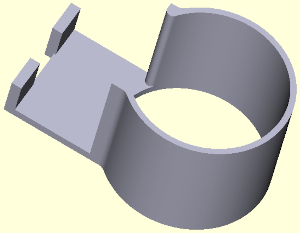
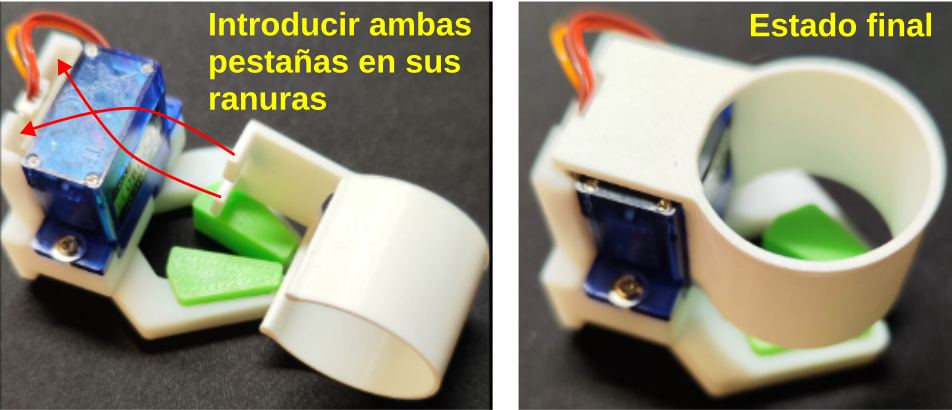
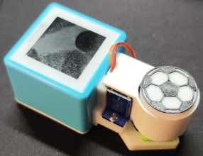
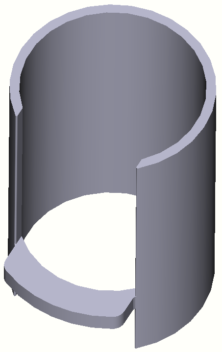
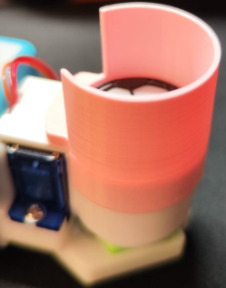
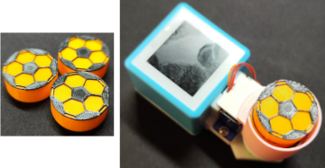
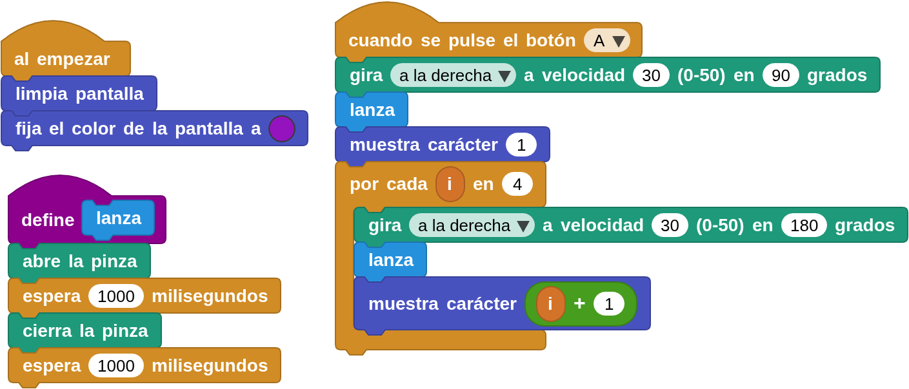

## **Apilador de balones**
Este reto se basa en el diseño realizado por **Shay Liang**, que, según sus propias palabras, explica que: *"cuando estaba organizando actividades, observó que, que los niños cuando dispusieron de varios balones de fútbol, disfrutaron mucho intentando apilarlos y lanzarlos".* Por eso diseñó la estructura de la imagen para guardar balones.

  
***[Archivo stl](../img/aux/ext_porta_balones/cocube%20ball%20storage.stl)***

El dispositivo anterior se acopla a la pinza con servo muy facilmente como se observa en la imagen siguiente:

  

La capacidad de esta estructura es de tres balones y el conjunto queda como se ve en la imagen siguiente:

  

He diseñado un expansor de la estructura que permite añadir otros tres balones encima de los anteriores. El diseño se ha realizado con la filosofía de que sea sencillo tanto de imprimir en 3D como de colocar.

  
***[Archivo stl](../img/aux/ext_porta_balones/ext_porta_balones.stl)***

El dispositivo se acopla a la estructura anterior muy facilmente como se observa en la imagen siguiente:

  

La capacidad ahora es de seis balones y el conjunto queda como se ve en la imagen siguiente:

  

A continuación se muestra un sencillo ejemplo de realización de lanzamientos de balón en dirección a las porterias del CoMap "Football Challenge" mientras en pantalla se muestra el número de lanzamientos realizado en color morado.

El programa y su enlace de descarga lo vemos en la imagen siguiente:

  
***[Descargar el programa]()***

El resultado del programa es:

  
***[Descargar el programa]()***

