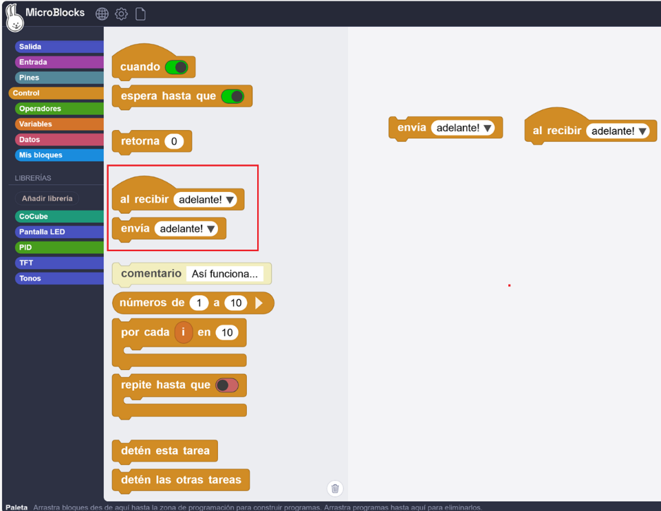
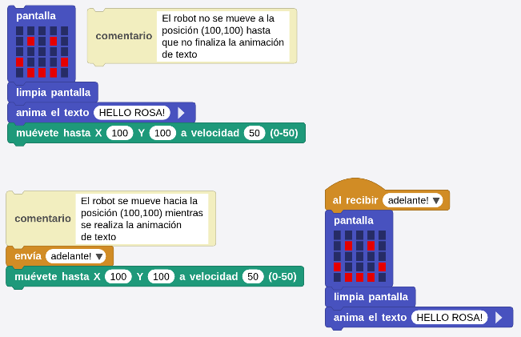
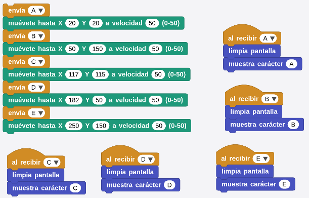
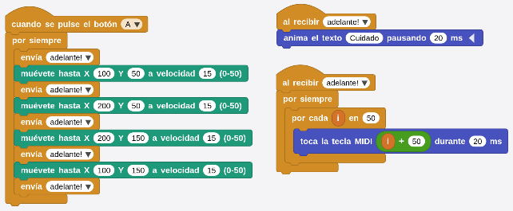

## **Objetivo**
Programación del robot CoCube para sincronizar procesos a través de broadcast.

## **Materiales**
Robot CoCube, pinza con servomotor y ordenador ejecutando el IDE de MicroBlocks.

## **Programación**
Anteriormente, nos hemos referido principalmente a las estructuras secuenciales, donde el programa ejecuta cada instrucción paso a paso en un orden predeterminado. Sin embargo, en la práctica, a menudo nos encontramos con situaciones en las que necesitamos ejecutar varias tareas al mismo tiempo. Aquí es donde entra en juego la función de transmisión (broadcast). En este caso, explicaremos cómo la función de difusión envía mensajes y cómo utilizar este mecanismo para lograr la ejecución paralela de dos partes de un programa.

**1.** **Conectar dispositivos**: conecta el IDE de MicroBlocks al robot CoCube mediante medios cableados o inalámbricos.

**2.** **Encuentra los bloques**: Abre la opción "Control", busca los bloques "al recibir" y "envía" y arrástralos al espacio de trabajo como se muestra en la imagen siguiente. La función de transmisión se logra a través de los dos bloques de construcción anteriores.

* **Ejecución de programas**: A través de la función de transmisión, es posible controlar el movimiento del robot CoCube y ejecutarlo en paralelo con la pantalla TFT. Haz los dos programas siguientes para experimentar la diferencia que ofrece la función de transmisión.

A continuación realizamos el programa de movimiento entre los puntos A y E utilizando el evento broadcast.

  
*[Descargar programa](../program/cocube/mov_broadcast.ubp)*

El resultado es el siguiente:

  

## **Reto: Vehículo con movimiento y sonido**
Probablemente hayas visto un camión u otro vehículo que cuando está en funcionamiento, se mueve o hace algo mientras emite sonidos para alertar a los peatones cercanos y que se alejen. Intentemos simular el funcionamiento de un vehículo de este tipo.

El programa sería el siguiente:

  
[Descargar programa](../program/cocube/mov_sonido.ubp)

