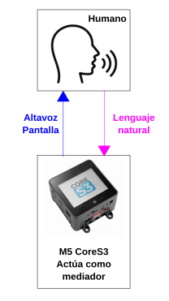
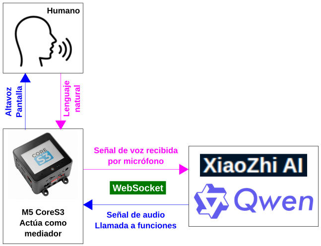
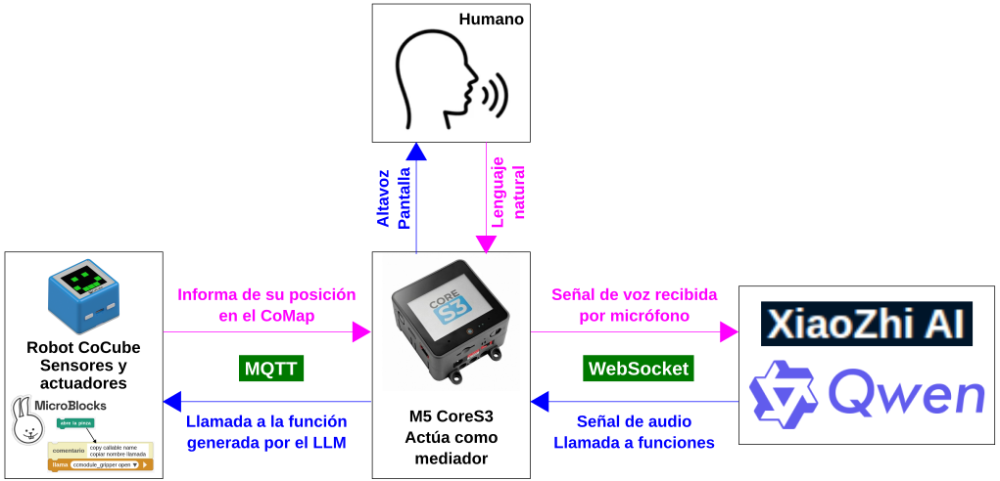

!!! Info ""
    La información siguiente se basa en la obtenida de la publicación en [hackster.io](https://www.hackster.io/) por el equipo CoCube: mistletoe235 • Shuai Liang • 陈重阳.

    [**Artículo**: "CoCube Meets M5 CoreS3: An AI Chat Robot"](https://www.hackster.io/cocube/cocube-meets-m5-cores3-an-ai-chat-robot-52be0f)

## **CoCube + M5STACK S3: chat robótico con IA**
Utilización de un LLM (Large Language Model o Modelo ampñlio de Lenguaje) para "hablar" con CoCube y que este trabaje sin necesidad de programar.

* ==**Modelo de lenguaje:**== Es el **Qwen** (también llamada Tongyi Qianwen) desarrollado por [Alibaba](https://es.wikipedia.org/wiki/Alibaba_Group).
* ==**Chatbot y asistente de voz de IA:**== Se utiliza **XiaoZhi** que se puede construir utilizando hardware de código abierto como el microcontrolador ESP32-S3 que lleva CoCube, permitiendo interacciones en lenguaje natural con modelos de lenguaje LLM con versiones que incluyen pantallas LCD y capacidades de voz. Aunque el nombre suena similar al asistente virtual chino Xiao Ai de Xiaomi, XiaoZhi es más un proyecto DIY que se enfoca en la experimentación y la personalización en el ecosistema de la domótica y la IA local, ofreciendo compañía y funciones de hogar inteligente.

!!! Note ""
    **Xiaozhi** es un proyecto de inteligencia artificial de código abierto para crear tu propio asistente de voz local, a menudo presentado en forma de robots o altavoces compactos con pantalla, ideal para entusiastas de la tecnología que desean experimentar con la IA.

  

## **Cosas que se van a usar**

|Hardware|||
|---|---|---|
||[M5Stack Core S3](https://www.hackster.io/m5stack/products/cores3?ref=project-52be0f)| x 1|
||[Robot CoCube](https://cocuberobot.com/es/)| x 1|
|<b>Software y servicios en línea</b>|||
||[Espressif ESP-IDF](https://www.hackster.io/Espressif/products/esp-idf?ref=project-52be0f)||
||[MicroBlocks](https://microblocks.fun/)||
||[Chatbot con IA XiaoZhi](https://xiaozhi.me/)||

## **Que se pretende hacer**
El uso de los LLM normalmente consiste en responder preguntas, escribir código y hacer otras tareas y terminan en una pantalla. Nuestra interactuación con los mismos normalmente se hace con texto hablado o escrito y muy raramente interactuamos con el mundo físico. En este ejemplo la idea es eliminar esa barrera.

Por un lado se utiliza el robot **CoCube**, que es un robot que se programa con con MicroBlocks, un **lenguaje de programación por bloques para computación física inspirado en Scratch**. La idea es añadir a **CoCube** la capacidad de *control por voz mediante un LLM*.

Por otra parte se utiliza el **M5Stack CoreS3**, un kit de desarrollo ESP32-S3 compacto con pantalla táctil, micrófono, altavoz y batería integrados. Esto lo convierte en una "puerta de enlace por voz" ideal: escucha, habla y ejecuta el [**firmware XiaoZhi AI**](https://github.com/78/xiaozhi-esp32) que se conecta directamente a CoCube a través de MQTT (Message Queuing Telemetry Transport o protocolo ligero de mensajería de publicación/suscripción).

Al combinar **XiaoZhi**, **CoreS3** y **MicroBlocks**, las frases habladas se traducen en acciones robóticas en tiempo real. El resultado es un conjunto donde un LLM no solo responde, sino que hace que el robot se mueva.

Una primera fase de comunicación se realiza entre la persona y CoreS3 empleando el lenguaje hablado y escrito a través del micrófono, el altavoz y la pantalla de M5 CoreS3.

  

Una segunda fase es enviar la información al servidor xiaozhi (impulsado por el LLM Qwen). El LLM procesa el mensaje recibido por voz, lo interpreta y envía el resultado a CoreS3, que nos lo comunica por su altavoz. Estos procesos se realizan utilizando WebSocket.

El LLM admite la llamada a funciones, por lo que hay que suministrarle las funciones de CoCube con sus implementaciones.

  

Finalmente se establece la comunicación entre CoreS3 y CoCube mediante MQTT, que es soportado por el LLM y MicroBlocks.

  

El mensaje *ccmodule_gripper open* es la llamada a la función *abre la pinza* y debe ser generado por el LLM.

El mensaje se envía a **CoCube** a través de un **tema (topic) MQTT**. Se utiliza la libreria MQTT de MicroBlocks junto con el bloque de llamada para implementar todas estas funciones.

En **MicroBlocks** es muy fácil obtener este nombre invocable ya que está asociado a la entrada "*copy callable name*" del menú contextual de cada bloque.

Mirar tambien el comap impreso bueno para ver como está sobre un A3 y comparar con los diseños propios.

Ver esto de CC y M5Stack: 
https://www.hackster.io/cocube/cocube-meets-m5-cores3-an-ai-chat-robot-52be0f