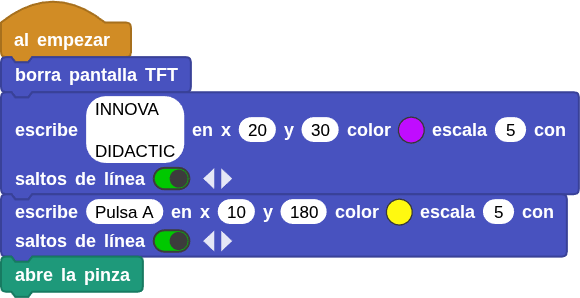
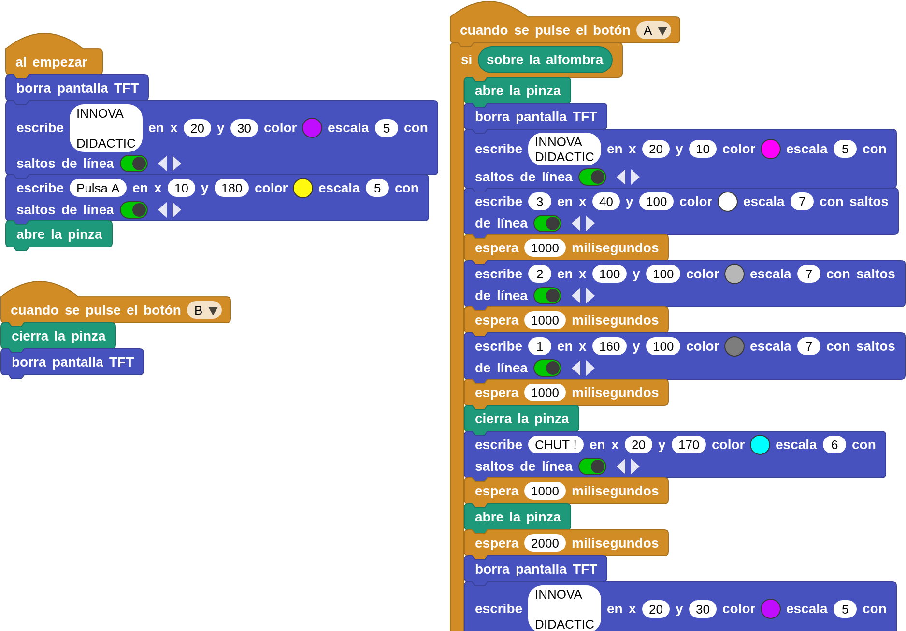

## **Introducción**
!!! Info "**IMPORTANTE**"
    Toda la información acerca de este apartado se fundamenta en la creada por **[Kathy Giori](https://microblocks.fun/about)** y el ejemplo que se desarrolla está basado en el creado por ella misma de nombre **reed.ubp.**  

El ejercicio consiste en crear un programa que controle la pinza del servo acoplado a CoCube mediante una cuenta regresiva 3,2,1. Los requisitos son:

1. Al iniciar, el sistema debe mostrar el texto “INNOVA DIDACTIC” y la instrucción “Pulsa A”.
2. Al presionar el botón A, si el CoCube está colocado sobre el tapete, debe realizar una cuenta regresiva de 3 a 1, cerrar la pinza, mostrar “CHUT!”, abrir la pinza y volver al mensaje inicial.
3. Si el CoCube no está sobre el tapete, debe mostrar un mensaje de advertencia indicando que debe colocarse correctamente.
4. Al presionar el botón B, la pinza debe cerrarse y la pantalla debe limpiarse.

## **Dependencias y Bloques principales**
El programa utiliza, bien directamente o bien por dependecias, las siguientes bibliotecas:

* **CoCube**: para controlar el robot (motores, sensores, lectura de tarjetas RFID). Esta tiene como dependencias las bibliotecas Tone, Display (Pantalla LED), TFT y PID.
* **CoCube Module**: para poder manejar el módulo externo del servomotor con pinza. Esta tiene como dependencias, de interés para este caso, las bibliotecas Servo y CoCube.
* **PID**: para bucle de control PID.
* **Servomotores**: para control de servos tanto posicionales (ángulo) como rotativos.
* **TFT**: para mostrar información en la pantalla de CoCube.

## **Inicio**
Al iniciar el programa:

* Limpia la pantalla.
* Muestra el texto “INNOVA DIDACTIC” en la parte superior.
* Luego muestra el mensaje “Pulsa A” en color amarillo para indicar al usuario que debe presionar el botón A.
* Finalmente, abre la pinza del robot

  

## **Al presionar el botón A**
* Comprueba si el CoCube está sobre el tapete (CoMap). Si sí lo está:

      * Abre la pinza y limpia la pantalla.
      * Vuelve a mostrar el texto “INNOVA DIDACTIC”.
      * Realiza una cuenta regresiva (3, 2, 1) en la pantalla con distintos tonos de gris y pausas de 1 segundo.
      * Cierra la pinza para efectuar un lanzamiento o chut.
      * Muestra el mensaje “CHUT !” (como un efecto de lanzamiento).
      * Abre nuevamente la pinza.
      * Espera 2 segundos.
      * Limpia la pantalla y vuelve al mensaje inicial “INNOVA DIDACTIC – Pulsa A”.

* Si no está sobre el tapete, muestra en pantalla el mensaje:

<b>
Pon  
CoCube  
sobre el  
CoMap
</b>

## **Al presionar el botón B**
* Cierra la pinza.
* Limpia la pantalla.

## **Programa**
!!! Warning "Aviso"
    Para que el programa funcione correctamente hay que añadir las bibliotecas PID y servomotor si no están ya agregadas

  
**[Descarga programa chutador.ubp](../program/cocube/chutador.ubp)**

