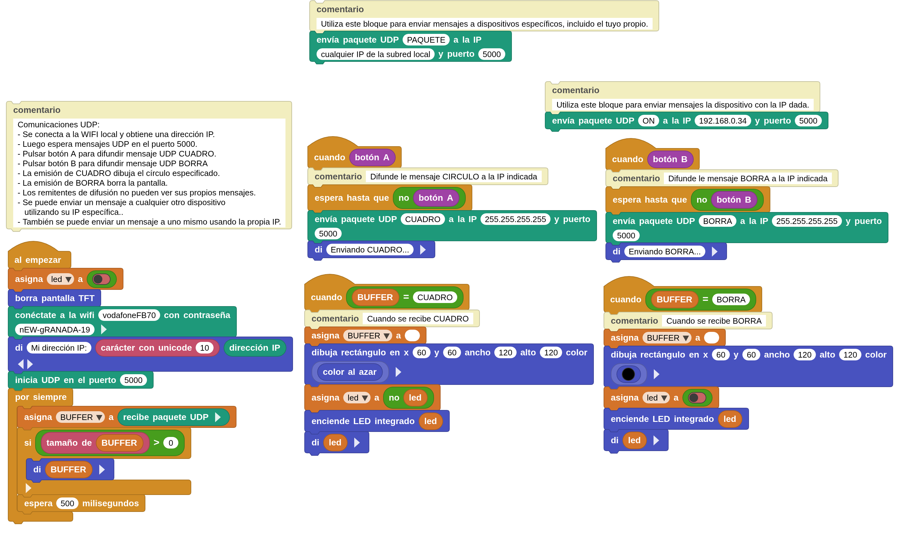

## **Objetivo**
Programación de al menos dos robots CoCube para enviar y recibir datos por UDP.

Nos basamos en la adaptación realizada en [Control remoto por UDP](https://fgcoca.github.io/ESP32-micro-STEAMakers/proyectos/udp/) que a su vez es una adaptación de la entrada [Remote control using UDP](https://wiki.microblocks.fun/en/wifi) disponible en la [MicroBlocks Wiki](https://wiki.microblocks.fun/en/wifi/udp) como una demostración del uso de UDP en MicroBlocks.

Aprenderemos a transmitir y recibir mensajes utilizando el [Protocolo de Datagramas de Usuario](https://es.wikipedia.org/wiki/Protocolo_de_datagramas_de_usuario) ([User Datagram Protocol o UDP](https://en.wikipedia.org/wiki/User_Datagram_Protocol)).

Dibujaremos y borraremos un cuadrado de color aleatorio en la pantalla TFT como respuesta a los correspondientes mensajes UDP enviados. En el caso de CoCube se asocia un cuadrado de 44x44 centrado en la primera fila (100,3) al pin de programación por lo que veremos parpadear dicho cuadrado cuando se realizan operaciones que utilizan el pin. En el ejemplo usaremos el bloque de "Salida" denominado "enciende LED integrado" para controlar este elemento.

En nuestro caso vamos a utilizar solamente robots CoCube para hacerlo, y estos tienen las características necesarias para hacerlo:

* Soportan WiFi
* Disponen de botones

## **Materiales**

* uno o más CoCube
* ordenador ejecutando el IDE de MicroBlocks.
* un teléfono móvil con Android (opcional).

Si sólo tienes un CoCube, puedes usarlo en combinación con la APP del teléfono móvil con Android. En el peor de los casos, si no tienes placas disponibles, pero posees un teléfono móvil con Android puedes experimentar con este tutorial usando tu teléfono.

En cuanto a la disponibilidad de WiFi, puedes empezar utilizando el proporcionado por el router de tu casa.

También describiremos una forma en la que puedes crear tu propio HotSpot WiFi, que será  muy útil si planeas trabajar en un área sin servicio WiFi.

!!! info "HotSpot WiFi"
    Un HotSpot WiFi es un lugar físico donde los usuarios pueden conectar a internet de forma inalámbrica dispositivos como teléfonos móviles o tablets.

## **Programación**
La idea es que todos los CoCube ejecuten exactamente el mismo programa y hagan exactamente lo mismo: encender y apagar el cuadrado asociado al LED de la placa al recibir mensajes UDP y enviar mensajes al pulsar alguno de los botones. Veamos el programa por partes:

**$\blacktriangleright$ Bloque al empezar:** gestiona el inicio de sesión WiFi, muestra la dirección IP obtenida del router local e inicia el puerto UDP. A continuación, el script entra en un bucle de recepción de mensajes y los muestra en el IDE.

  

En caso de no configurar WiFi correctamente aparecerá en el IDE el siguiente mensaje:

  

**$\blacktriangleright$ cuando botón A:** el bloque envía un mensaje de difusión UDP con "CUADRO" como contenido. Si la IP es 255.255.255.255 el mensaje se envia a todas las placas que estén en la red y si es una IP concreta el mensaje se envia a la placa con esa IP. El mensaje es enviado al soltar el botón.

  

**$\blacktriangleright$ Bloque BUFFER = CUADRO:** actúa sobre el mensaje CUADRO recibido y conmuta el estado del cuadrado asociado al LED integrado. Si estamos trabajando con al menos dos placas podemos observar como al pulsar el botón A en una placa aparece el mensaje en el IDE de este bloque en la otra y placa cambia de estado visible o no visible del citado cuadrado asociado al LED.

  

**$\blacktriangleright$ cuando botón B:** el bloque envía un mensaje de difusión UDP con "BORRA" como contenido. Si la IP es 255.255.255.255 el mensaje se envia a todas las placas que estén en la red y si es una IP concreta el mensaje se envia a la placa con esa IP. El mensaje es enviado al soltar el botón.

  

**$\blacktriangleright$ Bloque BUFFER = BORRA:** actúa sobre el mensaje BORRA recibido y apaga tanto el cuadrado asociado al LED integrado como el cuadrado dibujado.

  

**$\blacktriangleright$ Bloque envia paquete UDP...:** El programa incluye un bloque de envío UDP separado que puedes utilizar para ejercer la opción de enviar un mensaje UDP a ti mismo o a otro dispositivo específico.

  

Para ello, **es necesario tomar nota de la dirección IP** mostrada al inicio del programa y luego dirigir el mensaje a esa dirección específica para las respectivas placas de prueba.

Si estás utilizando la **APP de Android**, tendrá su **IP mostrada en la parte superior de la pantalla**.

El programa completo lo tienes en la imagen siguiente y en el enlace lo puedes descargar. No olvides configurar tus datos WiFi para que funcione correctamente.

  
*[Descargar programa](../program/cocube/comunicacionUDP.ubp)*

A continuación podemos observar el funcionamiento entre dos CoCubes del programa y observar como se puede conmutar la visibilidad del cuadrado asociado al LED integrado.

  

