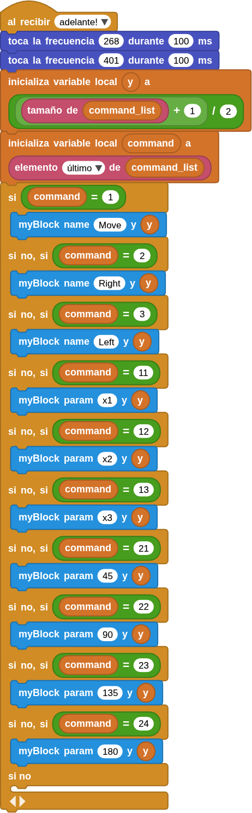
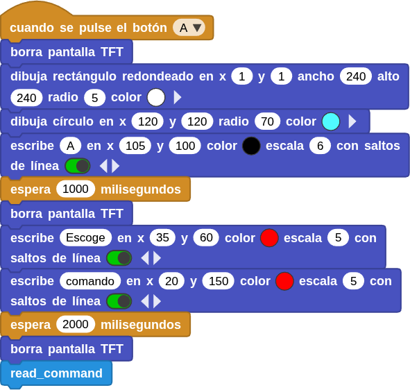
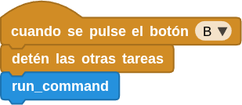
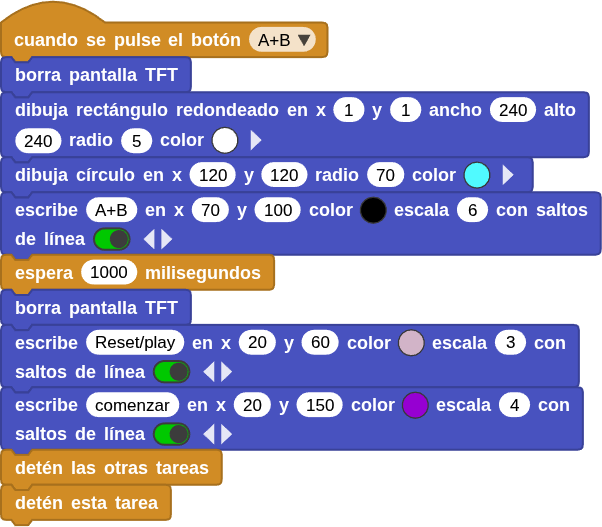
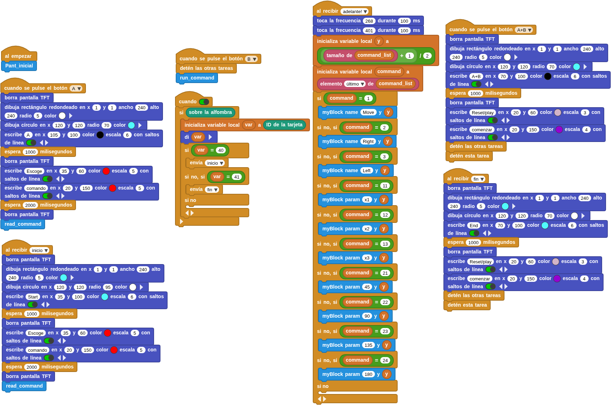

## <FONT COLOR=#007575>**Introducción**</font>
!!! Info "**IMPORTANTE**"
    Toda la información acerca de este apartado se fundamenta en la creada por **Shay Liang** y el ejemplo que se desarrolla está basado en el creado por el mismo de nombre **CoTags_Demo.ubp.**  

    **CoTag_demo** es una demostración sobre la programación con CoTags, que puede permitir a niños pequeños (y no tan pequeños), que no saben programar e incluso ni utuilizar ordenadores plasmar sus ideas a través de la programación.

Además hay que indicar que el ejercicio consiste en ampliar los programas vistos en apartados anteriores, pero su fundamento es justamente la lectura y ejecución de pares de valores.

## <FONT COLOR=#007575>**Dependencias y Bloques principales**</font>
El programa utiliza, bien directamente o bien por dependecias, las siguientes bibliotecas:

* **CoCube**: para controlar el robot (motores, sensores, lectura de tarjetas RFID). Esta tiene como dependencias las bibliotecas Tone, Display (Pantalla LED), TFT y PID.
* **Color**: para operaciones de color, trabaja con tono, saturación y brillo (HSV, iniciales de Hue, Saturation y Brightness).
* **Pantalla LED**: para las funciones primitivas de pantallas como la de micro:STEAMakers o BBC micro:bit.
* **PID**: para bucle de control PID
* **TFT**: para mostrar información en la pantalla de CoCube.
* **Tone**: para emitir sonidos (beeps).

## <FONT COLOR=#007575>**Eventos principales de botones**</font>
### <FONT COLOR=#AA0000>Función ```Pant_inicial```</font>
Muestra una pantalla de inicio en el display del robot en la que dibuja tres zonas con rectángulos de colores:
* Zona superior: mensaje “Botón A o Start”
* Zona media: mensaje “B - Ejecutar comandos”
* Zona inferior: mensaje “Botones A+B o End – FIN”

El propósito es mostrar al usuario las opciones de inicio:

* **A o Start** → Comenzar lectura de comandos pulsando el botón A o leyendo Start.
* **B** → Ejecutar los comandos leídos pulsando el botón B.
* **A+B o End** → Finalizar programa pulsando los botones A+B o leyendo End.

La función es la siguiente:

<center>

  

</center>

El resultado que se ve en la pantalla de CoCube es:

<center>

  

</center>

### <FONT COLOR=#AA0000>Funciones ```myBlock_name``` y ```myBlock_param```</font>
Estos dos bloques sirven para dibujar visualmente los comandos y sus parámetros en pantalla.

* **```myBlock_name foo bar```**

Dibuja un rectángulo con el nombre del comando (por ejemplo “Move”, “Right”, “Left”) en una posición determinada según bar.

<center>

  

</center>

* **```myBlock_param foo bar```**

Muestra el parámetro asociado a ese comando (por ejemplo, distancia o ángulo).

Así, cada comando leído se va mostrando en pantalla como una lista ordenada visualmente.

<center>

  

</center>

La función es la siguiente:

<center>

  

</center>

### <FONT COLOR=#AA0000>Función **```read_command```**</font>
Este es el núcleo de lectura de tarjetas CoTag de indicadores.

* Crea una lista vacía llamada ```command_list```.
* Usa un bucle "por siempre" para leer continuamente el ID de la tarjeta detectada.
* Dependiendo del valor leído (```var```), lo agrega a la lista si cumple ciertas condiciones lógicas:

      * Tarjetas < 10: se interpretan como comandos (mover, girar).
      * Tarjetas entre 10–25 o 40–42: se interpretan como parámetros (distancia o ángulo).

Cuando se agrega un nuevo comando, envía una señal broadcast 'adelante!'.

En resumen: **Lee CoTags o tarjetas físicas**, las clasifica como comandos o parámetros, y las va guardando en una lista de ejecución.

<center>

  

</center>

### <FONT COLOR=#AA0000>Función **```run_command```**</font>
Se encarga de ejecutar los comandos guardados en ```command_list```.

* Recorre la lista de dos en dos: comando y su parametro.
* Según el valor del comando:

      * 1: Mover hacia adelante → 'CoCube ```muévete hacia... por pasos```'
      * 2: Girar a la derecha → 'CoCube ```gira a la derecha... grados```'
      * 3: Girar a la izquierda → 'CoCube ```gira a la izquierda... grados```'

Por ejemplo: Si command=1 y param=12, el robot avanza una distancia proporcional a (param - 10) * 50.

<center>

  

</center>

### <FONT COLOR=#AA0000>Evento Broadcast 'adelante!'</font>
Cada vez que se lee una tarjeta nueva se  recibe una comunicación 'adelante!':

* El robot emite dos tonos.
* Muestra en pantalla el nuevo comando o parámetro mediante los bloques ```myBlock_name``` y ```myBlock_param```.
* Así el usuario puede ver la secuencia de comandos que va construyendo.

<center>

  

</center>

### <FONT COLOR=#AA0000>Botones</font>
* Cuando se pulsa el botón 'A':

      * Limpia la pantalla.
      * Muestra mensajes de “Escoge comando”.
      * Llama a ```read_command``` para iniciar la lectura de tarjetas.

<center>

  

</center>

* Cuando se pulsa el botón 'B':

      * Detiene todos los procesos previos.
      * Llama a ```run_command``` para ejecutar las órdenes almacenadas.

<center>

  

</center>

* Cuando se pulsan los botones 'A+B':

      * Limpia la pantalla.
      * Muestra un mensaje de “Reset / comenzar”.
      * Detiene todas las tareas (reinicio total).

<center>

  

</center>

## <FONT COLOR=#007575>**Tarjetas especiales**</font>
El script ```cuando true``` revisa constantemente si el CoCube está sobre el tapete lector:

* Si detecta la tarjeta con ID 40 (Start) → envía 'inicio'.
* Al recibir el mensaje de broadcast se muestran mensajes en pantalla y se llama a ```read_command```

<center>

  

</center>

* Si detecta la tarjeta con ID 41 (End) → envía 'fin'.
* Al recibir el mensaje de broadcast se muestran mensajes en pantalla y se detiene el programa hasta un nuevo inicio.

<center>

  

</center>

Luego, los eventos '```inicio```' y '```fin```' muestran pantallas animadas con esos mensajes y controlan el flujo general.

## <FONT COLOR=#007575>**Resumen**</font>
La secuencia general de uso es:

* Al encender → aparece la pantalla inicial (Pant_inicial).
* El usuario presiona A (o coloca CoCube sobre Start) → se inicia la lectura de tarjetas.
* El robot muestra los comandos leídos en pantalla.
* El usuario presiona B → el CoCube ejecuta la secuencia completa.
* Si se detecta la tarjeta Fin (ID 41) o se presiona A+B, el programa termina y muestra pantalla de cierre.

El programa implementa una interfaz visual y física de programación secuencial para CoCube:

* Las tarjetas (CoTags) son los bloques de comandos.
* La pantalla TFT muestra la secuencia y mensajes diversos.
* Los botones A, B y A+B controlan el flujo.
* El robot ejecuta la secuencia final de movimientos.

El programa completo listo para la descarga lo vemos a continuación:

<center>

  
***[Descargar el programa Demo_CoTag_indicadores](../program/cocube/Demo_CoTag_indicadores.ubp)***
</center>
