## <FONT COLOR=#007575>**Introducción**</font>
!!! Info "**IMPORTANTE**"
    Toda la información acerca de este apartado se fundamenta en la creada por **[Kathy Giori](https://microblocks.fun/about)** y el ejemplo que se desarrolla está basado en el creado por ella misma de nombre **football-teardown-f.ubp.**  

El ejercicio consiste en crear un programa capaz de detectar la posición del balón, soltar a CoCube en cualquier otra posición del CoMap "Football Challenge" y hacer que este se dirija a la posición inicial del balón y lo recoja con la pinza. Una vez recogido el balón lo mueve hasta la posición de lanzamiento y efectúa el mismo.

El juego trata de registrar la posición del balón en el campo de fútbol pulsando el botón A, para luego colocar al jugador donde queramos, pulsaremos el botón B y le diremos que busque el balón y lo meta en la portería.

## <FONT COLOR=#007575>**Dependencias y Bloques principales**</font>
El programa utiliza, bien directamente o bien por dependecias, las siguientes bibliotecas:

* **CoCube**: para controlar el robot (motores, sensores, lectura de tarjetas RFID). Esta tiene como dependencias las bibliotecas Tone, Display (Pantalla LED), TFT y PID.
* **CoCube Module**: para poder manejar el módulo externo del servomotor con pinza. Esta tiene como dependencias, de interés para este caso, las bibliotecas Servo y CoCube.
* **Color**: para operaciones de color, trabaja con tono, saturación y brillo (HSV, iniciales de Hue, Saturation y Brightness).
* **PID**: para bucle de control PID.
* **Servomotores**: para control de servos tanto posicionales (ángulo) como rotativos.
* **TFT**: para mostrar información en la pantalla de CoCube.

## <FONT COLOR=#007575>**Inicio y botones**</font>
<FONT COLOR=#FF00FF>**&#8227; Bloque *al empezar***</font>

* Este bloque se ejecuta automáticamente al iniciar el programa.
* Limpia la pantalla TFT.
* Llama a la función ```balon```, que dibuja el balón y muestra el texto “Hora de jugar futbol”.
* Abre la pinza o gripper del módulo con servomotor acoplado al robot (la pinza) para asegurarse de que está preparado.

<center>

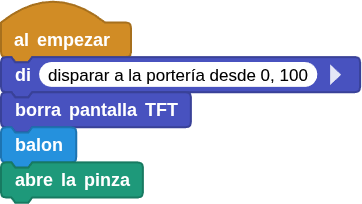  

</center>

<FONT COLOR=#FF00FF>**&#8227; Botón A**</font>

* Al presionar A, se limpia la pantalla.
* Si el CoCube está correctamente ubicado sobre el tapete de juego ("sobre la alfombra"):

      - Guarda la posición inicial del robot (x_ini, Y_ini) y su dirección (dir).
      - Muestra esos valores en pantalla con la función muestra-x_ini-y_ini.

* Si no está sobre el tapete, muestra un mensaje de error en color rojo.

<center>

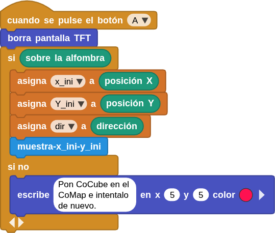  

</center>

<FONT COLOR=#FF00FF>**&#8227; Botón B**</font>

Al presionar B, el robot:

* Guarda su posición actual (x1, y1) y dirección (dir1).
* Muestra esos valores en pantalla con ```muestra-x1-y1```.
* Llama a la función ```ir a chutar```, que hace que el robot se desplace y patee.
* Luego muestra el texto "Anotaste?" y vuelve a dibujar el balón.

<center>

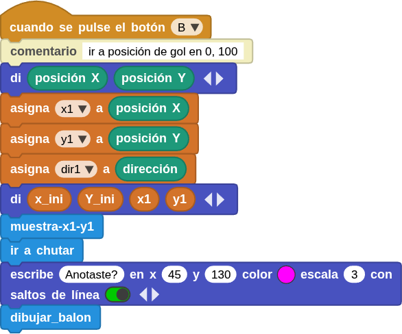  

</center>

<FONT COLOR=#FF00FF>**&#8227; Botón A+B**</font>

Al presionar A+B simultáneamente:

* Cierra la pinza del robot.
* Detiene todas las ruedas y la ejecución general del programa.
* Limpia la pantalla TFT.

Deja al robot listo para comenzar de nuevo.

<center>

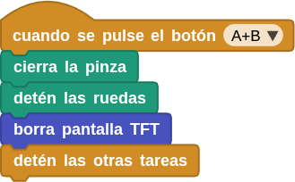  

</center>

## <FONT COLOR=#007575>**Funciones**</font>

<FONT COLOR=#500050>**&#8227; Función *balon***</font>

* Elige un tono gris aleatorio para el texto.
* Muestra el mensaje "Hora de jugar futbol" en tres líneas.
* Llama a dibujar_balon para representar gráficamente un balón.

<center>

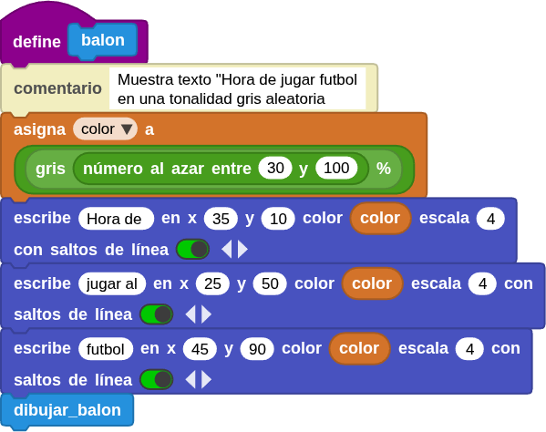  

</center>

<FONT COLOR=#500050>**&#8227; Función *dibujar_balon***</font>

* Dibuja un balón en pantalla combinando círculos (blanco y rojo) y triángulos para simular los paneles del balón.
* Usa coordenadas fijas para formar la figura.

<center>

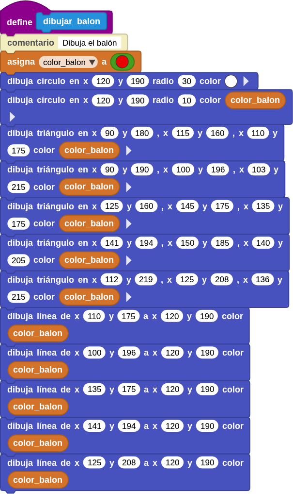  

</center>

<FONT COLOR=#500050>**&#8227; Función *ir a chutar***</font>

Simula que el robot va a chutar un balón:

* Cierra la pinza como medida para evitar que el balón se mueva antes de tiempo.
* Se mueve hasta alcanzar una posición objetivo. El robot se mueve hacia atrás hasta que su posición en el eje X esté 20 unidades por detrás de donde comenzó (```x_ini```).
* Se orienta hacia un punto de referencia con velocidad de giro 30. Se mueve hacia atrás a velocidad 40 durante 1 segundo (1000 ms). Luego actualiza su posición x1 con su valor actual.
* Si el robot se ha movido demasiado hacia arriba o abajo (diferencia mayor a 20 en el eje Y), corrige su posición. Apunta hacia su coordenada Y inicial (Y_ini) y se desplaza hasta alinearse con esa posición.
* El CoCube ahora vuelve a su punto inicial, el lugar donde estaba al principio. Se reorienta hacia (x_ini, Y_ini) y se mueve a esa posición a velocidad 40.
* Se orienta hacia la portería (en este caso, el punto (0, 100)). El número 15 indica una velocidad de giro más lenta y controlada, para apuntar con precisión.
* Si el punto inicial (x_ini) es mayor que 150, significa que el robot está lejos del campo de tiro. Entonces avanza poco a poco hacia adelante, corrigiendo su dirección hacia (0, 100) hasta llegar a la posición X = 150 o menos.
* Finalmente avanza y “patea”. El CoCube apunta nuevamente hacia la portería (0,100). Se mueve hacia adelante a velocidad 15 durante 700 ms, lo que simula el avance para chutar.
* En el momento del “impacto”: Cierra la pinza (como si empujara el balón), espera 1 segundo y la abre, soltando el balón tras el golpe.

En resumen:

<center>

| Etapa | Acción                      | Propósito                      |
| :-: | --------------------------- | ------------------------------ |
| 1   | Cierra pinza                | Prepararse para sujetar balón  |
| 2   | Retrocede hasta 20 unidades | Crear espacio para impulso     |
| 3   | Abre pinza                  | Soltar el balón                |
| 4   | Corrige eje Y               | Alinear posición lateral       |
| 5   | Regresa al punto inicial    | Recolocarse antes del disparo  |
| 6   | Apunta a (0,100)            | Alinear hacia portería         |
| 7   | Avanza si está muy lejos    | Colocarse a distancia adecuada |
| 8   | Avanza, cierra, suelta      | Simular el disparo (chute)     |

</center>

<center>

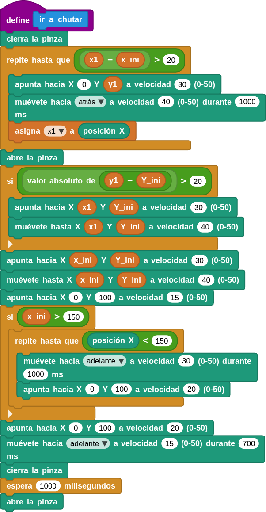  

</center>

<FONT COLOR=#500050>**&#8227; Función *muestra-x_ini-y_ini***</font>

* Muestra en pantalla TFT el texto “Posición del balón” y los valores de las coordenadas iniciales (x_ini, Y_ini) y la dirección (dir)
* Usa colores diferentes para distinguir cada dato.

<FONT COLOR=#500050>**&#8227; Función *muestra-x1-y1***</font>

Similar a la anterior, pero muestra la posición y dirección actuales del CoCube (después del movimiento).

A continuación se muestra un resumen general del programa:

<center>

| Sección | Propósito principal |
| --- | --- |
| **al comenzar** | Prepara el entorno y muestra el balón inicial.|
| **Botón A**| Guarda y muestra la posición inicial del robot.|
| **Botón B**| Ejecuta el movimiento de “chutar” y muestra la nueva posición. |
| **Botón A+B**| Detiene todo y limpia la pantalla.|
| **Función balon**| Dibuja el texto “Hora de jugar futbol” y el balón.|
| **Función dibujar_balon**| Dibuja el balón en pantalla con formas geométricas.|
| **Función ir a chutar**| Controla los movimientos del robot para simular un disparo.|
| **Función muestra-x_ini-y_ini / muestra-x1-y1** | Muestran en pantalla las coordenadas guardadas.|

</center>

## <FONT COLOR=#007575>**Programa**</font>
!!! Warning "Aviso"
    Para que el programa funcione correctamente hay que añadir las bibliotecas PID y servomotor si no están ya agregadas

<center>

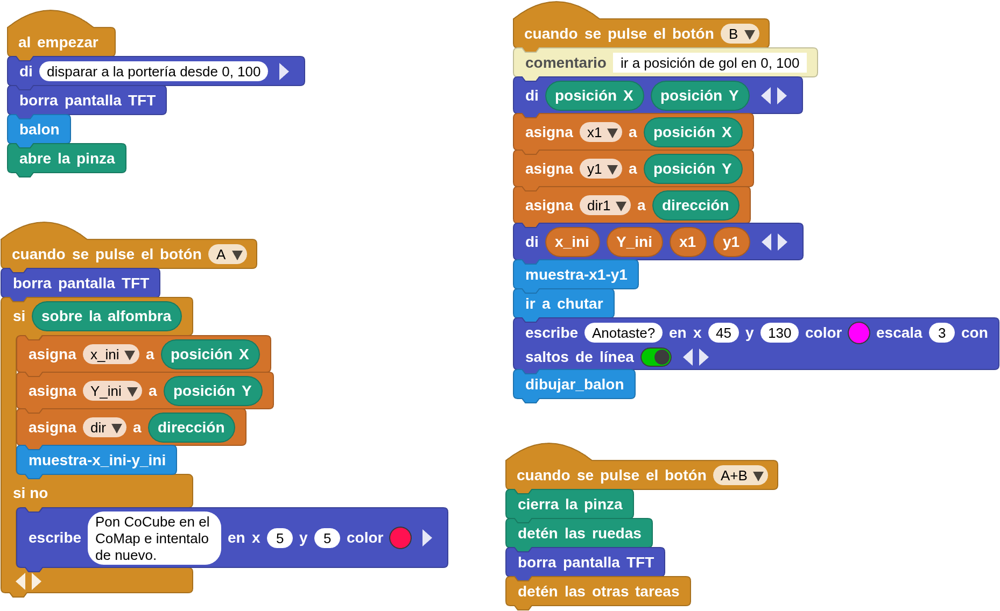  
**[Descarga programa futbol.ubp](../program/cocube/futbol.ubp)**

</center>

En el video siguiente podemos observar el funcionamiento del programa anterior con un pequeño error de posicionamiento a la hora de recoger el balón.

<center>

<iframe width="560" height="315" src="https://www.youtube.com/embed/XsAPhXdj_9M?si=QsyLMzQjPhbUzCXf" title="YouTube video player" frameborder="0" allow="accelerometer; autoplay; clipboard-write; encrypted-media; gyroscope; picture-in-picture; web-share" referrerpolicy="strict-origin-when-cross-origin" allowfullscreen></iframe>

</center>

## <FONT COLOR=#007575>**Porteria 3D**</font>
Para dar mayor realismo al juego he diseñado los elementos 3D necesarios para poder imprimir y montar de forma sencilla una porteria como la que se observa en la animación siguiente:

<center>

  

</center>

El ensamble se realiza encajando por presión los tetones de que disponen unas partes en los orificios de las otras. En la tabla siguiente están los archivos STL para descargar, imprimir y construir todas las que necesitemos.

<center>

|Imágen|STL|
|:-:|:-:|
|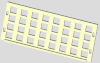|[Fondo](../img/aux/porteria/porteria-fondo.stl)|
|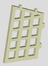|[Lateral x2](../img/aux/porteria/porteria-lateral.stl)|
|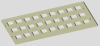|[Lateral x2](../img/aux/porteria/porteria-superior.stl)|
||[Todo en un zip](../img/aux/porteria/porteria.zip)|

</center>
