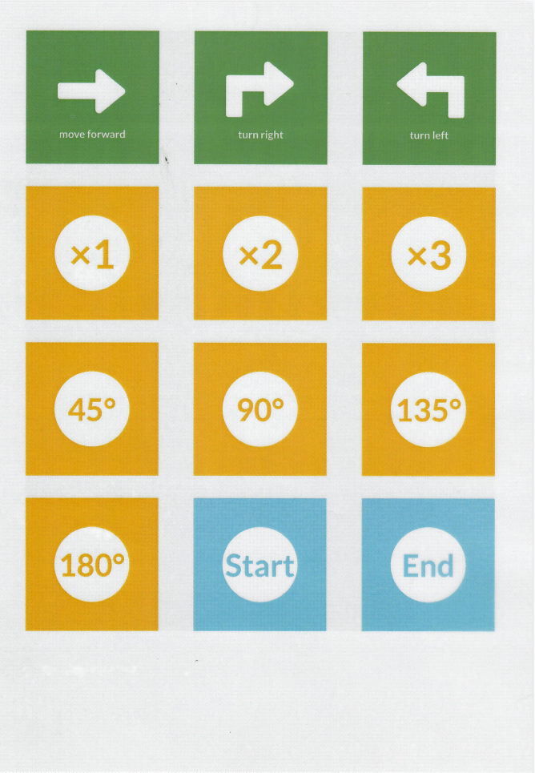
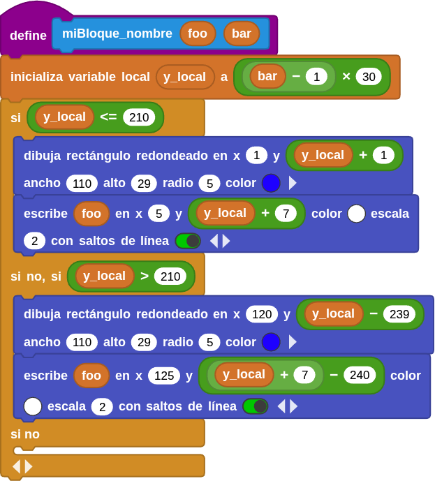
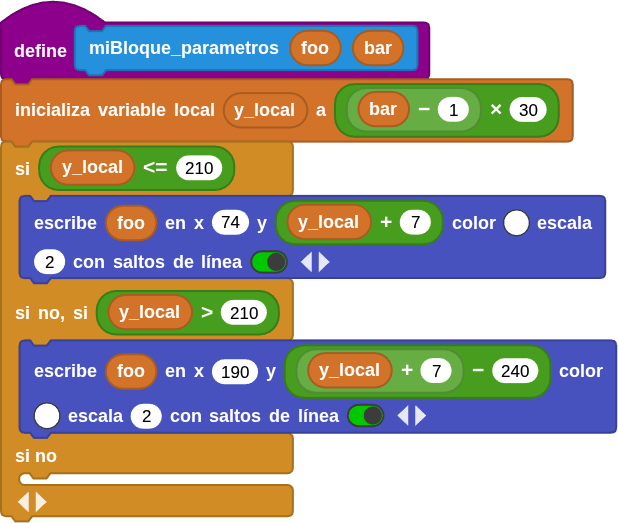
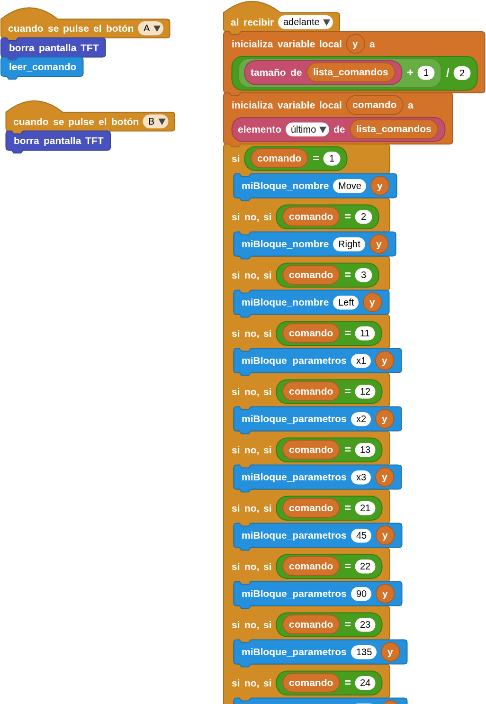
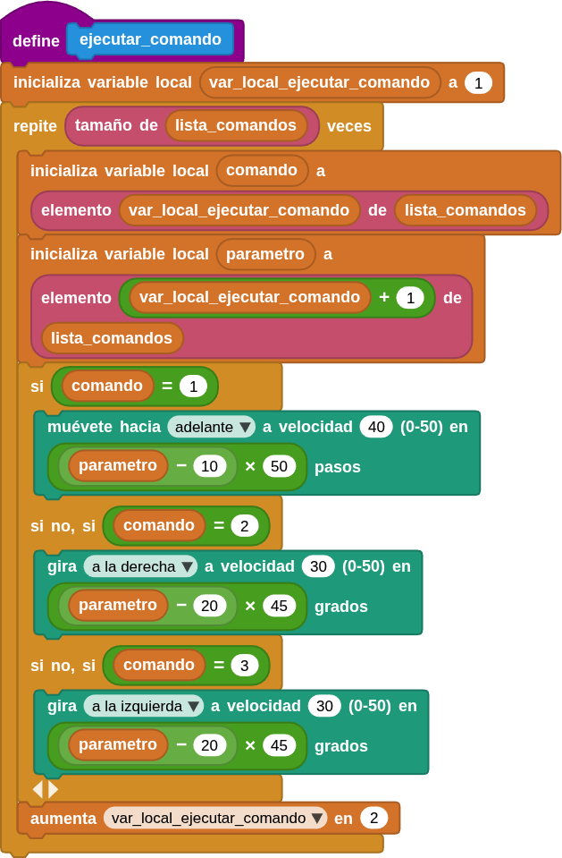
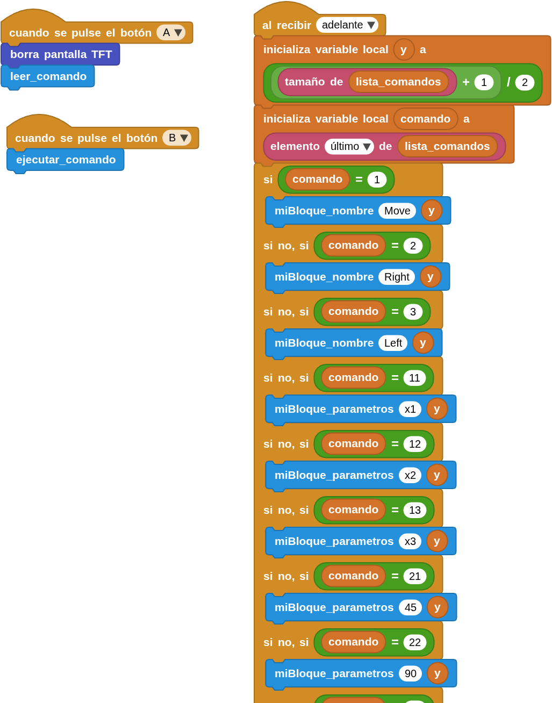
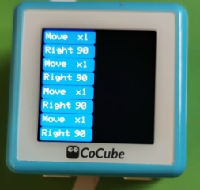
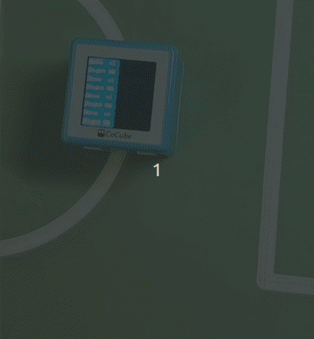

## <FONT COLOR=#007575>**Introducción**</font>
!!! Info "**IMPORTANTE**"
    Toda la información acerca de este apartado se fundamenta en la creada por **Shay Liang** y el ejemplo que se desarrolla está basado en el creado por el mismo de nombre **CoTags_Demo.ubp.**  

    **CoTag_demo** es una demostración sobre la programación con CoTags, que puede permitir a niños pequeños (y no tan pequeños), que no saben programar e incluso ni utuilizar ordenadores plasmar sus ideas a través de la programación.

En esta ocasión vamos a trabajar sobre un CoTag extensión del numérico visto. Se trata del tapete de señales de la imagen siguiente:

{.center-img}

A continuación se dan sendos enlaces para su descarga:

* [CoTag señales en A4 con puntos de 3x3px](../img/aux/CoTags/CoTags_A4_SIG_3x3_1200DPI.pdf)
* [CoTag señales en A4 con puntos de 4x4px](../img/aux/CoTags/CoTags_A4_SIG_4x4_1200DPI.pdf)


!!! Info "**Requisitos de impresión CoTags:**"
    1. La resolución de la impresora debe ser de 1200 ppp.
    2. Hay que imprimir en tamaño real, es decir, con una escala del 100 %.
    3. Los números 3x3 que aparecen en el nombre del fichero representa un tamaño de punto negro de 3x3 píxeles y 4x4 representa un tamaño de 4x4 píxeles.
    4. El color de fondo debe ser una impresión tricolor [CMY](https://es.wikipedia.org/wiki/Modelo_de_color_CMYK) y la tinta no debe contener carbono. Los puntos negros son el código y deben imprimirse con tinta negra que contenga carbono. Si los archivos PDF en color no se imprimen y dan un funcionamiento adecuado, es muy probable que el problema esté en la tinta.
    !!! Note "Información de interés"
        Si quieres una impresión comprobada y con garantias contacta con [Atigra Makers](https://atigra.es/#contact)

El listado de asignaciones es el siguiente:

|Función|Lectura|Descripción/Parámetro|
|:-:|:-:|---|
|move forward|1|Hace avanzar el robot una distancia fija|
|turn right|2|Gira el robot hacia la derecha|
|turn left|3|Gira el robot hacia la izquierda|
|x1|11|Número mínimo de pasos|
|x2|12|Número medio de pasos|
|x3|13|Número máximo de pasos|
|45º|21|Ángulo de giro de 45°|
|90º|22|Ángulo de giro de 90°|
|135º|23|Ángulo de giro de 135°|
|180º|24|Ángulo de giro de 180°|
|Start|40|Iniciar lecturas|
|End|41|Finalizar programa|

La idea es configurar las variables para que:

* Al colocar el robot sobre "move forward" se va a determinar la distancia o número de pasos de movimiento → controlada por las celdas "x1, x2 o x3".
* Al color el robot sobre "turn right" o "turn left" se va a determinar la orientación y el ángulo de giro a los valores "45º, 90º, 135º o 180º"
* Al colocar el robot sobre "Start" que se inicie la lectura de pares de valores.
* Al colocar el robot sobre "End" finaliza el programa

### <FONT COLOR=#AA0000>Obtener pares de valores</font>
Vamos a comenzar resolviendo la adquisición de pares de valores para saber los datos relativos a "avanzar/distancia" y "girar izquierda o derecha/ángulo". La captura de datos comenzará cuando se pulse el botón A y se mostrarán en la pantalla de CoCube. El botón B lo utilizaremos para borrar la pantalla.

####<FONT COLOR=#0000FF>**&#129094; Función para leer comandos**</font>

Para tener un código mejor estructurado vamos a crear desde ```mis bloques``` una definición de función (bloque de código) encargada de leer los comandos.

**&#129030; Variables**

* ```ultimo_ID```: guarda el último ID leído (números 1, 2, 3, 11, 12, 13, 21, 22, 23 y 24), para evitar repeticiones.
* ```lista_comandos```: crea una lista vacía donde se almacenan los IDs leídos.

**&#129030; Bucle**

Se utiliza un bucle ```por siempre``` (se repite constantemente) donde **CoCube lee el ID de la tarjeta** y lo guarda en una variable local nombrada como ```var_loc_l_c```.

**&#129030; Lógica condicional**

La idea es detectar cuando se sitúa CoCube sobre una nueva señal, comparar su ID con el anterior, y decidir si se agrega a la lista o no.

La condición establecida para la sentencia condicional indica que se evaluará como verdadera solamente si:

* Hay un **nuevo ID** (la variable local es distinta del último ID)
* El ID leido **no es 0** (CoCube no está sobre una señal válida)

Una vez dentro del bucle, porque se ha evaluado como verdadera la condición, se dan varios casos según el valor del ID y el último comando leído.

!!! Note "Broadcasting"
    Los bloques "al recibir..." y "envia..." suelen utilizarse juntos para lograr un medio de comunicación dentro del programa. Cualquier mensaje enviado con el comando BROADCAST "envia..." se detecta y se recibe a través del bloque "al recibir...". Por lo tanto, los bloques colocados debajo de este bloque se ejecutarán al recibir el mensaje correspondiente. Los mensajes pueden ser cadenas o números. Además, el bloque "ultimo"" contiene el último mensaje transmitido y recibido.

    La transmisión de esta forma es similar a llamar a una función, ya que ambas invocan acciones con nombre, pero funcionan de manera diferente y tienen fines distintos.

1. **Primer grupo (IDs menores a 10):** Si el ID leido es menor a 10 se agrega a la lista y se emite un broadcast denominado 'adelante' que describimos posteriormente.
2. **Segundo grupo (si el último fue 1 y el nuevo está entre 10 y 20):**
3. **Tercer grupo (si el último fue 2 o 3 y el nuevo entre 10 y 25):**
4. **Cuarto grupo (si el último fue 2 o 3 y el nuevo entre 39 y 42):**

Cada vez que una de las condiciones anteriores se cumple:

* Se agrega el ID a la lista
* Se actualiza ultimo_ID
* Se emite via broadcast 'adelante'

**&#129030; Propósito general**

En resumen, esta función o bloque de código:

1. **Lee continuamente señales con CoCube.**
2. **Verifica** si el ID leído cumple ciertas condiciones.
3. **Evita duplicados** usando ultimo_ID.
4. **Guarda** los IDs válidos en una lista llamada lista_comandos.
5. **Envía una señal “adelante”** para que otros bloques o scripts respondan

En la imagen siguiente tenemos el esta función expresada en modo gráfico:

{.center-img50}

####<FONT COLOR=#0000FF>**&#129094; Broadcast "al recibir 'adelante'"**</font>

**&#129030; Contexto general**

El bloque "al recibir 'adelante'" se ejecuta cada vez que se envía el mensaje 'adelante', el cual proviene del bloque leer_comando del código de la función anterior.

El programa usa la librería TFT, para poder mostrar información en la pantalla TFT de CoCube.

**&#129030; Funciones personalizadas "miBloque...**

* ```miBloque_nombre foo bar```

Este bloque dibuja un rectángulo con las esquinas redondeadas con un texto principal (foo) en la pantalla TFT.

Lo que hace es:

* Calcula una posición vertical (```y_local```) según el número de fila ```bar```.
* Si ```y_local ≤ 210```, dibuja en la columna izquierda (x = 1).
* Si ```y_local > 210```, dibuja en la columna derecha (x = 120).
* Cada *“casilla”* mide 30 px de alto (29 px de rectángulo + margen).
* El texto (```foo```) se muestra en color blanco sobre un rectángulo azul celeste.

En resumen: Dibuja un rectangulo azul con un texto blanco que corresponde al nombre del comando.

En la imagen siguiente vemos esta función:

{.center-img75}

* ```miBloque_parametros foo bar```

Este bloque muestra el texto del parámetro asociado, es decir un valor numérico o un subcomando al la derecha del del nombre del comando.

Lo que hace es:

* Calcula la misma posición vertical (y_local).
* Muestra el texto, sin el rectángulo, a la derecha del nombre del comando.
* Usa coordenadas x ≈ 74 o 190 para alinear el texto dentro de la caja.

En resumen: Muestra el valor o parámetro asociado a un comando (por ejemplo: “x1”, “45º”, etc.).

En la imagen siguiente vemos esta función:

{.center-img75}

**&#129030; Bloque principal**

Este bloque reacciona al mensaje emitido desde la función ```leer_comando``` y decide qué mostrar en la pantalla según el valor del último comando leído. Explicación:

* La variable ```lista_comandos``` viene de la función donde se guardan los IDs leídos.
* La variable ```comando``` obtiene el último valor de esa lista y calcula la posición de línea donde se va a escribir de manera que cada dos comandos forman una “línea” (nombre + parámetro), que es el motivo de usar ```(tamaño de lista_comandos + 1) / 2```.

####<FONT COLOR=#0000FF>**&#129094; Interpretación de comandos**</font>

Luego hay una serie de condiciones que interpretan el valor del comando:

|ID del comando|Acción|Bloque usado|Texto mostrado|
|:-:|---|---|:-:|
|1|Nombre del comando|```miBloque_nombre```|"Move"|
|2|Nombre del comando|```miBloque_nombre```|"Right"|
|3|Nombre del comando|```miBloque_nombre```|"Left"|
|11|Parámetro|```miBloque_nombre```|"x1"|
|12|Parámetro|```miBloque_nombre```|"x2"|
|13|Parámetro|```miBloque_nombre```|"x3"|
|21|Parámetro|```miBloque_nombre```|45º|
|22|Parámetro|```miBloque_nombre```|90º|
|23|Parámetro|```miBloque_nombre```|135º|
|24|Parámetro|```miBloque_nombre```|180º|

Así, dependiendo del ID leído, se muestra un nombre de comando (izquierda), o su parámetro asociado (a la derecha).

El bloque broadcast ```al recibir...``` es el siguiente:

{.center-img50}

####<FONT COLOR=#0000FF>**&#129094; Programa**</font>
El programa completo con las funciones ocultas (disponibles en Mis bloques) listo para su descarga lo vemos en la imagen siguiente:

{.center-img}

*[Descargar el programa: Obtener_pares_valores.ubp](../program/cocube/Obtener_pares_valores.ubp)*

En la animación siguiente vemos como capturar pares de valores:

{.center-img}

En la imagen siguiente vemos la pantalla de CoCube tras una serie de pares de valores capturados:

{.center-img50}

### <FONT COLOR=#AA0000>Ejecutar pares de valores</font>
Ahora vamos a evolucionar el programa anterior para que, una vez obtenidos los pares de valores, CoCube se mueva sobre un tapetete según la secuencia que capturemos.

Para ello vamos a definir una nueva función ("Mis Bloques") que denominaremos ```ejecutar_comando``` y que será invocada cuando pulsemos el botón B. Su aspecto es el de la imagen siguiente:

{.center-img75}

Se crea una variable local que servirá como **índice** para recorrer la lista de comandos (lista_comandos) de dos en dos.

####<FONT COLOR=#0000FF>**&#129094; Bucle**</font>

* El bucle se repite tantas veces como elementos tenga la lista.
* Dentro del bucle, se toman **pares de valores consecutivos** (un comando y su parámetro).
* Luego, el índice aumenta de **2 en 2**, porque cada acción ocupa dos posiciones en la lista.

La forma de obtener los pares comando–parámetro es:

* ```comando```: el número que indica qué tipo de acción realizar (mover o girar)p
* ```arametro```: el valor que indica el multiplicador para el número de pasos o en qué ángulo realizar el giro.

####<FONT COLOR=#0000FF>**&#129094; Ejecución según comando**</font>
Dependiendo del valor del **comando**, CoCube ejecuta una instrucción distinta:

* **Comando 1 → Mover hacia adelante.** Mueve el robot hacia adelante a una velocidad de 40 una distancia de 50 pasos (Si el parámetro = 11 → (11 − 10) × 50), o de 100 pasos (Si el parámetro = 12 → (12 − 10) × 50) o de 150 pasos (Si el parámetro = 13 → (13 − 10) × 50).
* **Comando 2 → Girar a la derecha.** Gira a la derecha a velocidad 30 un ángulo que depende del parámetro. Si el parámetro = 21 → (21 − 20) × 45 = 45°; Si el parámetro = 22 → 90°, etc.
* **Comando 3 → Girar a la izquierda.** Gira a la derecha a velocidad 30 con un ángulo que se determina igual que antes.
* **Avanza al siguiente par.** Después de ejecutar una acción, pasa al siguiente par de valores de comando y parámetro.

####<FONT COLOR=#0000FF>**&#129094; Programa**</font>
El programa completo listo para su descarga lo vemos en la imagen siguiente:

{.center-img}

*[Descargar el programa: Ejecutar_pares_valores.ubp](../program/cocube/Ejecutar_pares_valores.ubp)*

Si por ejemplo hacemos la lectura de valores de la imagen siguiente haremos que CoCube se mueva describiendo un cuadrado al ponerlo sobre un tapete y pulsar el botón B.

{.center-img50}

En la animación siguiente vemos el funcionamiento tras esa lectura:

{.center-img}
