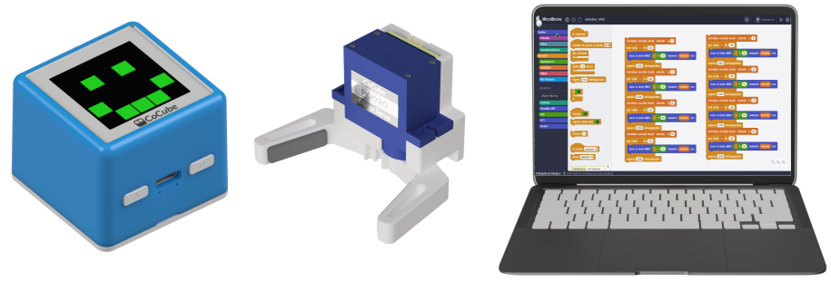
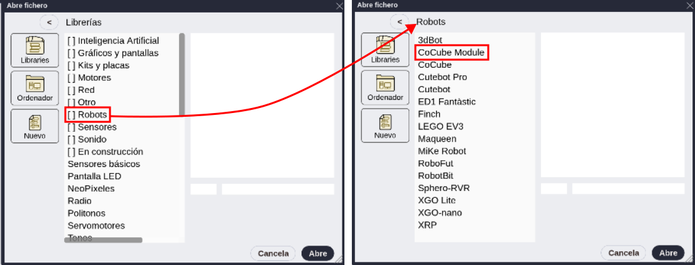

## **Objetivo**
El robot CoCube se puede utilizar junto con módulos externos para implementar funciones más complejas. En esta sección se explica cómo programar el uso del módulo del servo con pinza de agarre.

## **Materiales**
Robot CoCube, pinza con servomotor y ordenador ejecutando el IDE de MicroBlocks.

## **Programación**

**1.** **Conectar dispositivos**: conecta el IDE de MicroBlocks al robot CoCube mediante medios cableados o inalámbricos. A continuación, conecta la servopinza al robot CoCube.

**2.** **Cargar libreria de módulos externos**: haz clic en añadir libreria, escoge la opción "Robots" y en la nueva ventana "CoCube Module".

* **Bloques para la pinza**: Haz clic en "CoCube Module" en la biblioteca de bloques de la izquierda y arrastra los tres bloques que afectan a la pinza "abre la pinza", "cierra la pinza" y "pon la pinza a (0 a 70 grados)" al espacio de trabajo.

* **Ejecuta el bloque de cierre**: Haz clic con el botón izquierdo en el bloque "abre la pinza" o "cierra la pinza", cuando se ilumine un halo verde alrededor del bloque, significa que el programa se ha ejecutado con éxito y puedes ver la pinza abriéndose o cerrándose. Rellena el espacio para ángulo con un número de 0 a 70 en el bloque "pon la pinza a (0 a 70 grados)" y la pinza girará hasta colocarse en el ángulo correspondiente.

En el ejemplo siguiente vemos este funcionamiento.

  
*[Descargar programa](../program/cocube/abrir_cerrar_pinza.ubp)*

## **Reto: Mover un objeto entre dos puntos con CoCube**
Utilizar Cocube para que sujete un objeto entre sus pinzas y lo mueva desde una localización inicial hasta el punto E del mapa del laberinto.

El programa sería el siguiente:

  
[Descargar programa](../program/cocube/mover_objeto.ubp)

