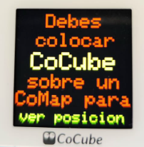
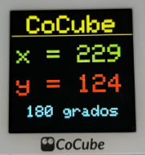
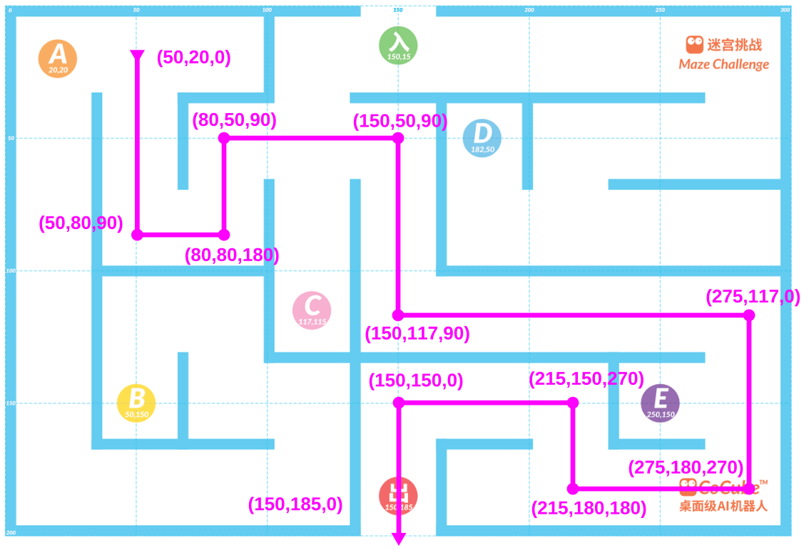
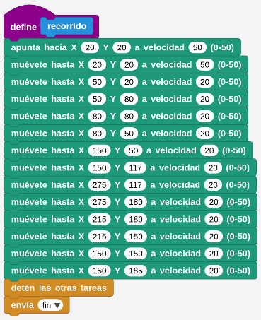
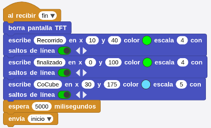
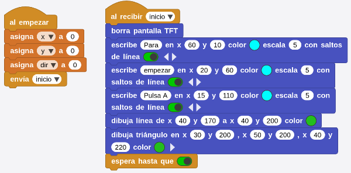
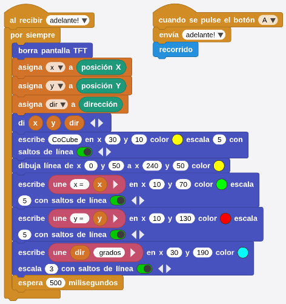
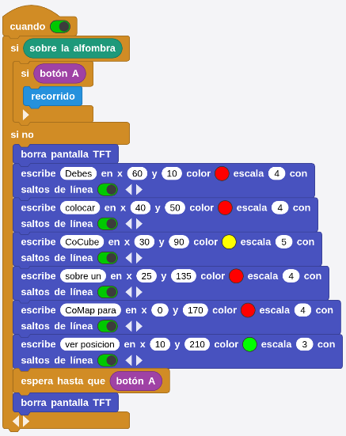
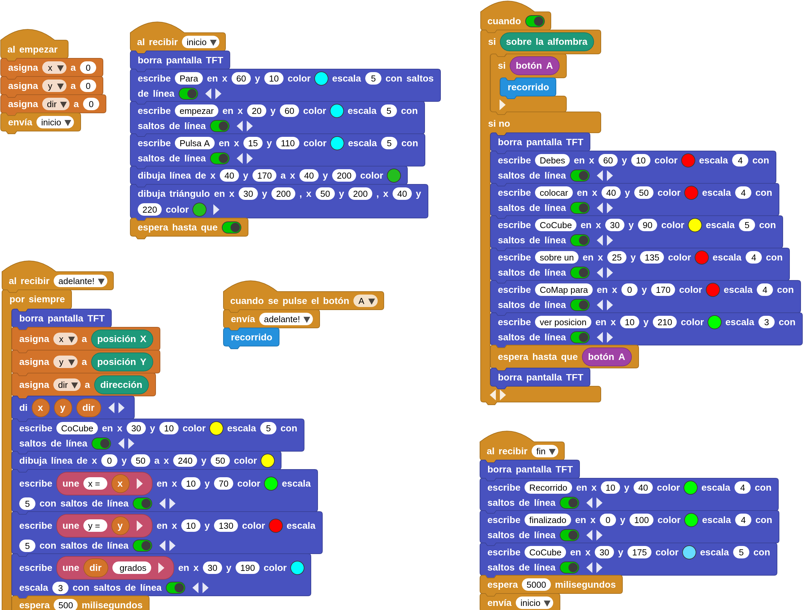

## **Introducción**
El ejercicio consiste en primer lugar en crear un programa que muestre las coordenadas X e Y y la orientación en grados del robot en cualquier posición de un CoMap. En segundo lugar se programa la resolución del laberinto partiendo de la posición A(20,20) con orientación 180º y saliendo del mismo por la posición (150,185). Los requisitos son:

* Si el robot no está sobre un CoMap o no lo lee correctamente, CoCube debe mostrar:

{.center-img50}

* Con el robot sobre un CoMap el aspecto de la pantalla será:

{.center-img50}

## **Programa**
!!! Warning "Aviso"
    Para que el programa funcione correctamente hay que añadir las bibliotecas PID y servomotor si no están ya agregadas

{.center-img}

*[Descarga programa position.ubp](../program/cocube/position.ubp)*

## **Laberinto**
Utilizando el programa anterior leemos las coordenadas y orientaciones necesarias para que CoCube realice el siguiente trazado en el CoMap "Maze Challenge", partiendo desde cualquier punto del mismo, cuando se pulse el botón A.

{.center-img}

Comenzamos por definir la función "recorrido", que tiene el siguiente aspecto:

{.center-img50}

Una vez finalizado el recorrido se envía el mensaje broadcast "fin" para indicar durante 5 segundos que el recorrido ha finalizado y después llamar, también por bradcast a "inicio", que a continuación se verá en que consiste.

{.center-img50}

Creamos el programa "al comenzar" utilizándo una llamada de boradcast que denominamos "inicio" para poder invocar esta parte una vez finalizado el recorrido y así dejar CoCube listo para comenzar de nuevo. "inicio" se encarga de mostrar el mensaje "Para empezar pulsa A" junto una flecha que apunta al botón del robot.

{.center-img}

Ahora se muestra el programa "cuando se pulse el botón A" que a su vez utiliza el broadcast "adelante!". Aquí se realizada la llamada a la función "recorrido". "adelante!" se encarga de asignar los datos de la posición actual del robot sobre el CoMap y mostrarlos tanto en pantalla como en el IDE de forma continuada.

{.center-img}

Finalmente se utiliza un bloque "cuando" siempre verdadero que se encargará de mostrar el mensaje por pantalla de que el robot no está sobre el tablero y si la comprobación es cierta simplemente llama a la función "recorrido".

{.center-img}

A continuación se ve el programa completo junto al enlace de descarga del mismo.

{.center-img}

*[Descarga programa position_maze.ubp](../program/cocube/position_maze.ubp)*

En el video siguiente podemos observar el funcionamiento del programa anterior con pequeños errores de posicionamiento.

<iframe width="700" height="394" src="https://www.youtube.com/embed/ZkNkMW1lv10?si=-3FpylIPe9AuZWUB" title="YouTube video player" frameborder="0" allow="accelerometer; autoplay; clipboard-write; encrypted-media; gyroscope; picture-in-picture; web-share" referrerpolicy="strict-origin-when-cross-origin" allowfullscreen></iframe>
