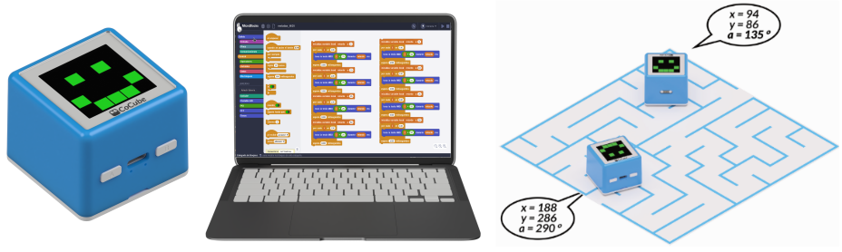
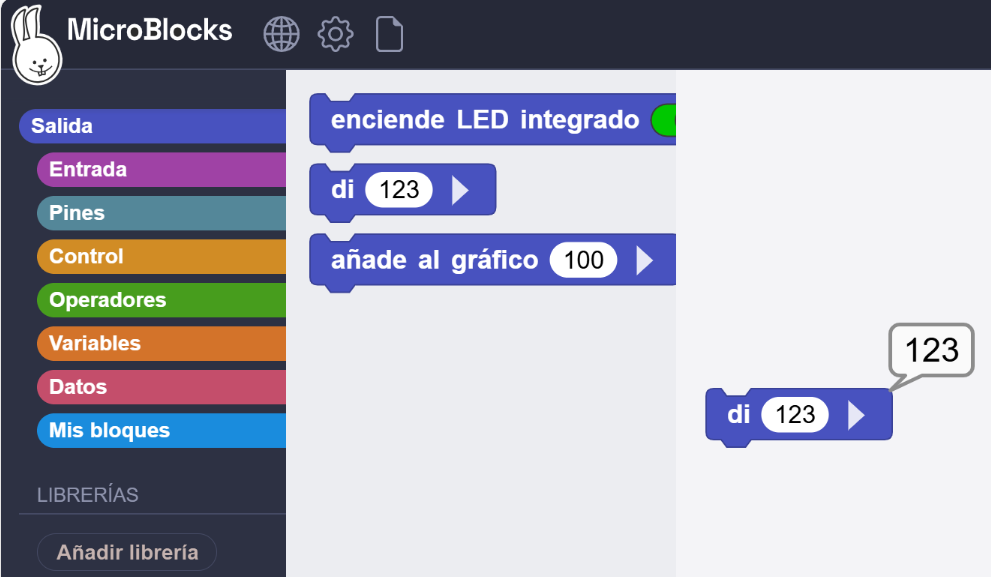

## **Objetivo**
El objetivo es programar el robot CoCube para que aprenda la función de posicionamiento por coordenadas de la alfombrilla de posicionamiento y el movimiento direccional punto a punto del robot, y comprender las funciones de salida en MicroBlocks durante este proceso.

## **Materiales**
Robot CoCube, ordenador ejecutando el IDE de MicroBlocks y CoMap.

## **Programación**
### Conociendo los mapas de ubicación
CoMaps proporciona a los robots CoCube capacidades de posicionamiento muy precisas.

Vamos a trabajar con el mapa de ubicación temática **Maze Challenge (Reto del laberinto)**.

Observando el CoMap de cerca podemos indicar:

* Las coordenadas de la esquina superior izquierda del mapa son (0,0), las de la esquina inferior derecha son (300,200), el eje X aumenta de izquierda a derecha desde 0 hasta 300 y el eje Y aumenta de arriba a abajo desde 0 hasta 200.
* El robot está orientado 0 grados en la dirección positiva del eje Y y 180 grados cuando está orientado en la dirección negativa del eje Y, y el ángulo de rotación aumenta en sentido contrario a las agujas del reloj.
* Hay líneas discontinuas impresas en el mapa cada 50 unidades, lo que puede ayudar a localizar rápidamente la ubicación de las coordenadas.

### Haz que CoCube diga su posición
¿Cómo puedo obtener la posición y el ángulo precisos de la situación del robot CoCube en el mapa de CoMaps?

**1.** **Conecta el dispositivo**: conecta el IDE de Microblocks al robot CoCube a través de una conexión Bluetooth y colócalo en la plataforma de posicionamiento.

**2.** **Utiliza los bloques "di"**.

* Abre la libreria "Salida", arrastre el bloque "di 123" y haz clic en "Ejecutar". Verás que en el IDE de MicroBlocks aparece una pequeña burbuja en la esquina superior derecha del bloque que indica "123".
* ¡Eso es lo que hace el bloque "di_"! En lugar de dejar que el robot CoCube realmente hable, te mostrará algo en el IDE de MicroBlocks.

* Si quieres decir dos cosas al mismo tiempo, simplemente haz clic en el pequeño triángulo a la derecha del bloque "di_" y escribe el contenido que deseas generar en el nuevo campo de entrada.
* También puedes rellenarlos con bloques de la biblioteca de bloques "Operadores", y CoCube enviará el resultado final al IDE de MicroBlocks.

* **Mostrar coordenadas con CoCube**. Arrastre los bloques "Posición X", "Posición Y" y "Ángulo de dirección" de la biblioteca de bloques CoCube y colócalos en el bloque "di_". Haz clic en el bloque para indicar las coordenadas del CoCube en su posición actual.

* Para obtener las coordenadas y los ángulos del CoCube en tiempo real, se puede anidar el bloque "di__" en un bloque "por siempre".

  
*[Descargar programa](../program/cocube/di_posicion.ubp)*

Observamos como se actualizan los datos con el movimiento del CoCube por el CoMap.

También podemos utilizar el bloque "añade al gráfico" de la categoria "Salida" y ver las coordenadas en un gráfico.

**3.** **Gráficado de la posición de CoCube**:

* **Conecta el dispositivo**: conecta el IDE de Microblocks al robot CoCube a través de una conexión Bluetooth y colócalo en la plataforma de posicionamiento.
* Usando los bloques "añade al gráfico" modificamos el programa para que sea como el siguiente. Para obtener las gráficas, haz clic en el icono situado en la parte superior derecha del IDE de MicroBlocks. Las curvas roja, verde y azul representan los valores de la posición X, la posición Y y el ángulo del robot CoCube, respectivamente.

  
*[Descargar programa](../program/cocube/di_posicion_grafica.ubp)*

### Movimiento preciso
Retomamos el ejemplo de trazar una trayectoria cuadrada con CoCube. Pero ahora vamos a utilizar bloques de movimiento por pasos para indica a los motores paso a paso del robot el número exacto de pasos que deben dar.

  
*[Descargar programa](../program/cocube/mov_preciso.ubp)*

## **Reto: Movimiento A-B-C-D-E**
Se trata de utilizar los bloques que devuelven coordenadas junto a los bloques de movimiento para hacer que CoCube se desplace desde el punto A hasta el punto E pasando por los puntos B, C y D y orientandose en cada caso hacia la posición en la que la celda del laberinto está abierta antes de seguir su ruta.

El programa es el siguiente:

  
*[Descargar programa](../program/cocube/mov_ABCDE.ubp)*

En el video podemos observar los movimientos del robot. La posición inicial del robot puede ser cualquiera siempre que esté sobre el CoMap.

<iframe width="560" height="315" src="https://www.youtube.com/embed/_CvZPjsFOss?si=gamPHB0yoQsTBio8&amp;start=3" title="YouTube video player" frameborder="0" allow="accelerometer; autoplay; clipboard-write; encrypted-media; gyroscope; picture-in-picture; web-share" referrerpolicy="strict-origin-when-cross-origin" allowfullscreen></iframe>

Si por algún motivo CoCube se sitúa fuera del mapa de posicionamiento nos lo indicará mediante el mensaje destacado a continuación.

  

## **Reto: Resolver el laberinto**
Utiliza los bloques que devuelven coordenadas y la función de movimiento paso a paso del mapa de posicionamiento para navegar desde la entrada hasta la salida del laberinto. Es decir, desde (150,15) hasta (150,185).

El programa es el siguiente:

  
*[Descargar programa](../program/cocube/laberinto.ubp)*

En el video podemos observar los movimientos del robot. La posición inicial del robot puede ser cualquiera siempre que esté sobre el CoMap.

<iframe width="560" height="315" src="https://www.youtube.com/embed/Q6-3kBRkncQ?si=1RPkgCBYs_okzVcM&amp;start=3" title="YouTube video player" frameborder="0" allow="accelerometer; autoplay; clipboard-write; encrypted-media; gyroscope; picture-in-picture; web-share" referrerpolicy="strict-origin-when-cross-origin" allowfullscreen></iframe>

En la resolución del laberinto observamos que CoCube se mueve demasiado rápido y no reliza los giros de manera suave. Puedes probar a reducir la velocidad de movimiento a ángulos mas precisos tras cada localización.
