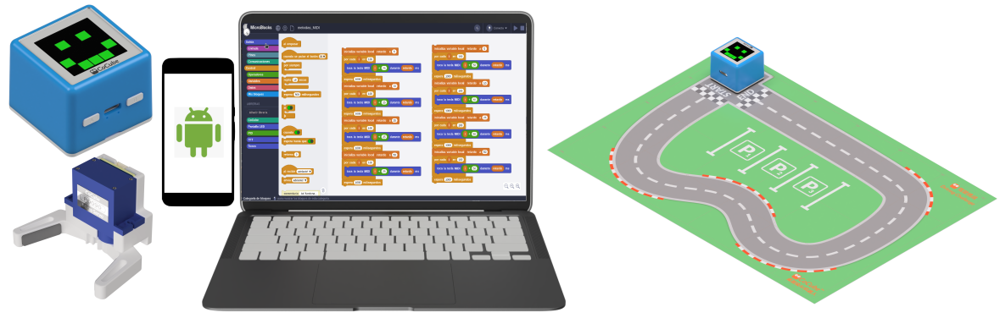

## **Objetivo**
Simplemente se realiza una adaptación del tutorial [Integración de MicroBlocks y APP Inventor WEBsocket](https://fgcoca.github.io/ESP32-micro-STEAMakers/proyectos/microblocks_websocket/) para utilizar la aplicación crada con MIT APP INVENTOR.

## **Materiales**

* un CoCube
* ordenador ejecutando el IDE de MicroBlocks.
* CoMap Driving Challenge
* un teléfono móvil con Android.

## **Programación**
Los programas en MicroBlocks y la aplicación para Android se realizan siguiendo el tutorial expresado al principio por lo que unicamente exponemos el funcionamiento en el video siguiente:

<iframe width="560" height="315" src="https://www.youtube.com/embed/1yTjXwXDBiU?si=WXjAnXb5kkYIdFOl" title="YouTube video player" frameborder="0" allow="accelerometer; autoplay; clipboard-write; encrypted-media; gyroscope; picture-in-picture; web-share" referrerpolicy="strict-origin-when-cross-origin" allowfullscreen></iframe>

