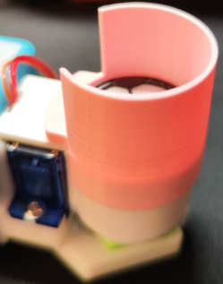
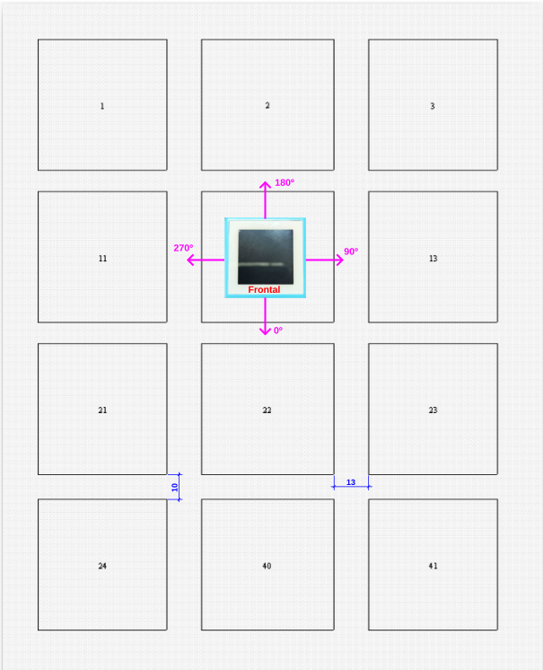
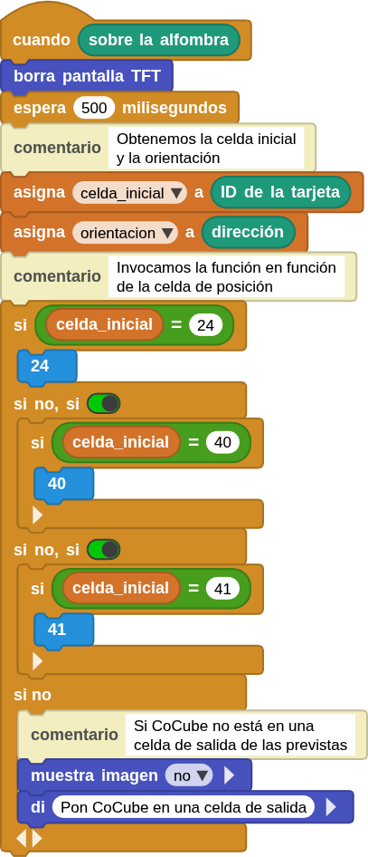

## <FONT COLOR=#007575>**Apilador de balones**</font>
Este reto se basa en el diseño realizado por Shuai Liang, creador del robot CoCube, que, según sus propias palabras, explica que: *cuando estaba organizando actividades, observó que, que los niños cuando dispusieron de varios balones de fútbol, disfrutaron mucho intentando apilarlos y lanzarlos. Por eso diseñó la estructura de la imagen para guardar balones.

<center>

  
***[Archivo stl](../img/aux/ext_porta_balones/cocube%20ball%20storage.stl)***

</center>

El dispositivo anterior se acopla a la pinza con servo muy facilmente como se observa en la imagen siguiente:

<center>

  

</center>

La capacidad de esta estructura es de tres balones y el conjunto queda como se ve en la imagen siguiente:

<center>

  

</center>

He diseñado un expansor de la estructura que permite añadir otros tres balones encima de los anteriores. El diseño se ha realizado con la filosofía de que sea sencillo tanto de imprimir en 3D como de colocar.

<center>

  
***[Archivo stl](../img/aux/ext_porta_balones/ext_porta_balones.stl)***

</center>

El dispositivo se acopla a la estructura anterior muy facilmente como se observa en la imagen siguiente:

<center>

  

</center>

La capacidad ahora es de cinco balones y el conjunto queda como se ve en la imagen siguiente:

<center>

  

</center>

A continuación se muestra un sencillo ejemplo de realización de lanzamientos de balón en dirección a las porterias del CoMap "Football Challenge" mientras en pantalla se muestra el número de lanzamientos realizado en color morado.

El programa y su enlace de descarga lo vemos en la imagen siguiente:

<center>

  
***[Descargar el programa]()***

</center>

El resultado del programa es:

<center>

  
***[Descargar el programa]()***

</center>

## <FONT COLOR=#007575>**Movimiento básico por CoTag numérico**</font>
Veamos un enunciado general: Se dispone de un tablero con una configuración de cuadrados de 5x5 cm numerados con esta estructura:

<center>

<table>
  <tr>
    <td>1</td>
    <td>2</td>
    <td>3</td>
  </tr>
  <tr>
    <td>11</td>
    <td>12</td>
    <td>13</td>
  </tr>
    <tr>
    <td>21</td>
    <td>22</td>
    <td>23</td>
  </tr>
    <tr>
    <td>24</td>
    <td>40</td>
    <td>41</td>
  </tr>
</table>
</center>

Los cuadrados están separados 13 mm en horizontal y 10 mm en vertical.

La idea es crear un programa en MicroBlocks para CoCube que al comenzar muestre en pantalla el mensaje "Pon CoCube sobre CoTag" y el robot permanezca parado hasta que se pulse el botón A en cuyo caso el robot avanza por el CoTag. En el avance sobre la alfombra, se asigna a una variable el ID de la celda sobre la que está el robot, se indica el dato obtenido en el IDE y se muestra en la pantalla al tiempo que suena un sonido MIDI. Pulsar el botón B hace que el robot se detenga.

### <FONT COLOR=#AA0000>Especificaciones del comportamiento</font>

**1. Inicio del programa**

* Mostrar en pantalla: "Pon CoCube sobre CoTag".
* Robot detenido.

**2. Botón A**

* Al pulsar el robot avanza.

**3. Botón B**

* Al pulsar el robot se detiene.

**4. Lectura de posición sobre el CoTag**

Si el robot está sobre la alfombra (CoTag detectado):

* Guardar en una variable el número de la celda.
* Mostrar el valor de la variable en el IDE.
* Mostrar en la pantalla del CoCube ese valor.
* Emitir una nota MIDI: 60 + celdaID.

### <FONT COLOR=#AA0000>Programa en MicroBlocks</font>
El programa completo y el enlace de descarga del mismo lo tenemos a continuación:

<center>

  
**[Descargar P_Mov_basico_CoTag_num](../program/cocube/P_Mov_basico_CoTag_num.ubp)**

</center>

## <FONT COLOR=#007575>**Recorrer todo el CoTag numérico**</font>
Trabajando sobre el mismo CoTag que en el ejemplo anterior, ahora la idea es definir un recorrido que comience en una de las celdas de la fila inferior (24, 40 o 41) y que recorra todo el tablero pasando por todas las celdas excepto la de inicio. El recorrido lo debe resolver CoCube identificando cada cuadrado por su número o ID mostrándo durante todo el recorrido la celda de partida. CoCube también sabe la orientación en grados que tiene sobre el tablero que sería así respecto a la parte delantera del robot situado en la celda 12 mirando hacia 22: 12-Robot orientado a 22 -> 0 grados; 13 -> 90 grados; 2 -> 180 grados y 11 -> 270 grados.

En la imagen siguiente podemos ver estos detalles:

<center>

  

</center>

A continuación se dan sendos enlaces para descargar los correspondientes CoTags:

* [CoTag numérico en A4 con puntos de 3x3px](../img/aux/CoTags/CoTags_A4_3x3_1200DPI.pdf)
* [CoTag numérico en A4 con puntos de 4x4px](../img/aux/CoTags/CoTags_A4_4x4_1200DPI.pdf)

!!! Info "Para imprimir"
    - La resolución de la impresora debe ser de 1200 ppp como mínimo.
    - Hay que imprimir en el tamaño original, es decir, con una escala del 100 %.
    - 3x3 representa que el tamaño del punto negro es de 3x3 píxeles, y 4x4 representa que el tamaño del punto negro es de 4x4 píxeles. Si 3x3 no se imprime con claridad, puedes probar con el archivo 4x4.

### <FONT COLOR=#AA0000>Reglas generales del juego</font>

**1. Objetivo**

* CoCube parte desde una de las tres celdas de la fila inferior: 24, 40 o 41.
* Debe recorrer todas las demás celdas una sola vez (visitar las 11 celdas restantes) y terminar cuando todas hayan sido visitadas. La celda de inicio no debe volver a visitarse.

**2. Tablero y distancias (centros de casilla → centro de casilla)**

* Cada casilla mide: 5 × 5 cm (50 mm × 50 mm).
* Separación entre casillas: horizontal 13 mm, vertical 10 mm.
* Distancia centro–centro horizontal = 50 + 13 = 63 mm (6.3 cm); vertical = 50 + 10 = 60 mm (6.0 cm).

**3. convención de ángulos (absoluta respecto al tablero)**

* Tomado desde la posición de 12 mirando a 22:

    &#8259; 0° = mirando hacia 22 (sur, hacia abajo en la representación).
    &#8259; 90° = hacia 13 (este, derecha).
    &#8259; 180° = hacia 2 (norte, arriba).
    &#8259; 270° = hacia 11 (oeste, izquierda).

* Los incrementos de ángulo son en sentido horario (ej. de 0° a 90° gira a la derecha).

<center>

  

</center>

**4. Movimientos permitidos**

* Sólo movimientos entre casillas adyacentes en las 4 direcciones ortogonales (N, S, E, O).
* Cada movimiento consiste en girar hasta la orientación absoluta que lleva a la casilla objetivo y avanzar la distancia apropiada (63 mm para E/O o 60 mm para N/S).

**5. Identificación**

* CoCube identifica cada casilla por su número (el robot debe mostrar el ID de la casilla por la que está pasando).

### <FONT COLOR=#AA0000>Algoritmo paso a paso para CoCube</font>
A continuación tienes las secuencias precomputadas (paso a paso) para los tres posibles puntos de partida (24, 40, 41). Usa la secuencia correspondiente según la celda de inicio.

<FONT COLOR=#0000FF><b>Rutas precomputadas y comandos directos</b></font>

He precomputado rutas Hamiltonianas $^{(ver \space nota)}$. Para cada inicio la lista contiene la secuencia completa (incluyendo la celda de inicio). En cada paso indico:

* desde → a : dirección (N/S/E/O) — orientación absoluta (grados)
* distancia a avanzar (mm). Distancias: E/O = 63 mm, N/S = 60 mm.

!!! Note "NOTA"
    Según Wikipedia, en teoría de grafos, un [camino hamiltoniano](https://es.wikipedia.org/wiki/Camino_hamiltoniano) en un grafo es un camino (es decir, una sucesión de aristas adyacentes), que visita todos los vértices del grafo una sola vez. Si además el primer y último vértice visitado coincide, el camino es un ciclo hamiltoniano.

**&#8227; Si empiezas en 24**

Ruta: 24 → 40 → 41 → 23 → 22 → 21 → 11 → 12 → 13 → 3 → 2 → 1

Pasos:

* Leer celda inicial (24)
* 24 → 40 : E — 90° — 63 mm. (leer 40)
* 40 → 41 : E — 90° — 63 mm. (leer 41)
* 41 → 23 : N — 180° — 60 mm. (leer 23)
* 23 → 22 : O — 270° — 63 mm. (leer 22)
* 22 → 21 : O — 270° — 63 mm. (leer 21)
* 21 → 11 : N — 180° — 60 mm. (leer 11)
* 11 → 12 : E — 90° — 63 mm. (leer 12)
* 12 → 13 : E — 90° — 63 mm. (leer 13)
* 13 → 3 : N — 180° — 60 mm. (leer 3)
* 3 → 2 : O — 270° — 63 mm. (leer 2)
* 2 → 1 : O — 270° — 63 mm. (leer 1)

Fin: todas las celdas distintas de la inicial (24) han sido visitadas.

**&#8227; Si empiezas en 40**

Ruta: 40 → 24 → 21 → 22 → 12 → 11 → 1 → 2 → 3 → 13 → 23 → 41

Pasos:

* Leer celda inicial (40)
* 40 → 24 : O — 270° — 63 mm. (leer 24)
* 24 → 21 : N — 180° — 60 mm. (leer 21)
* 21 → 22 : E — 90° — 63 mm. (leer 22)
* 22 → 12 : N — 180° — 60 mm. (leer 12)
* 12 → 11 : O — 270° — 63 mm. (leer 11)
* 11 → 1 : N — 180° — 60 mm. (leer 1)
* 1 → 2 : E — 90° — 63 mm. (leer 2)
* 2 → 3 : E — 90° — 63 mm. (leer 3)
* 3 → 13 : S — 0° — 60 mm. (leer 13)
* 13 → 23 : S — 0° — 60 mm. (leer 23)
* 23 → 41 : S — 0° — 60 mm. (leer 41)

Fin: todas las celdas distintas de la inicial (40) han sido visitadas.

**&#8227; Si empiezas en 41**

Ruta: 41 → 40 → 24 → 21 → 22 → 23 → 13 → 12 → 11 → 1 → 2 → 3

Pasos:

* Leer celda inicial (41)
* 41 → 40 : O — 270° — 63 mm. (leer 40)
* 40 → 24 : O — 270° — 63 mm. (leer 24)
* 24 → 21 : N — 180° — 60 mm. (leer 21)
* 21 → 22 : E — 90° — 63 mm. (leer 22)
* 22 → 23 : E — 90° — 63 mm. (leer 23)
* 23 → 13 : N — 180° — 60 mm. (leer 13)
* 13 → 12 : W — 270° — 63 mm. (leer 12)
* 12 → 11 : W — 270° — 63 mm. (leer 11)
* 11 → 1 : N — 180° — 60 mm. (leer 1)
* 1 → 2 : E — 90° — 63 mm. (leer 2)
* 2 → 3 : E — 90° — 63 mm. (leer 3)

Fin: todas las celdas distintas de la inicial (41) han sido visitadas.

### <FONT COLOR=#AA0000>Programa en MicroBlocks</font>
Comenzamos por definir el bloque ```al empezar``` de la forma siguiente:

<center>

  

</center>

Para simplificar y hacer mas legible el programa se definen tres funciones (una para cada celda de salida) que definen los recorridos indicados.

* **Función 24**

<center>

  

</center>

* **Función 40**

<center>

  

</center>

* **Función 41**

<center>

  

</center>

Finalmente programamos el comportamiento mediante un bloque interruptor activo cuando CoCube está situado ```sobre la alfombra```.

<center>

  

</center>

El programa completo con las funciones ocultadas y el enlace de descarga del mismo lo tenemos a continuación:

<center>

  
**[Descargar P_CoTag_numeros](../program/cocube/CoTag_numeros.ubp)**

</center>

### <FONT COLOR=#AA0000>Funcionamiento del programa</font>
A continuación se puede ver el funcionamiento del programa partiendo de una de las celdas o casillas de salida, siendo las otras dos similares.

<center>

<iframe width="315" height="560"
src="https://youtube.com/embed/uy4d_hptk_A?si=17lus90C6zkT9Qas/"
title="Programa CoTag números"
frameborder="0"
allow="accelerometer; autoplay; clipboard-write; encrypted-media; gyroscope; picture-in-picture; web-share"></iframe>

</center>
