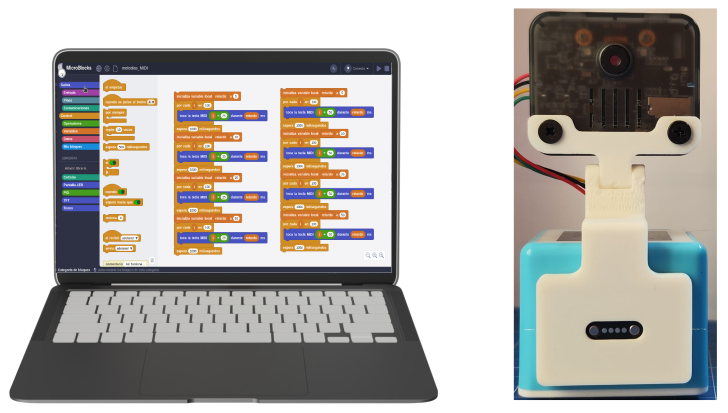
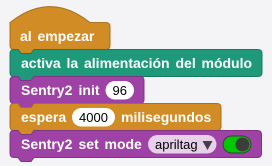
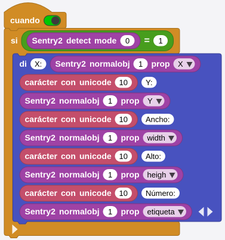
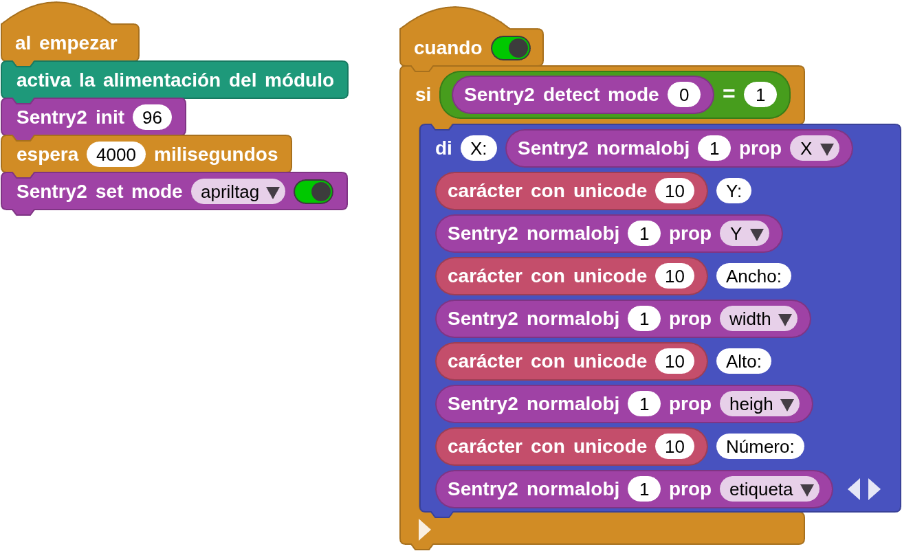

## **Objetivo**
Aprender sobre la función de reconocimiento AprilTag de Sentry2.

Se recomienda la lectura de la entrada [Marcador AprilTag](https://fgcoca.github.io/GuiasFundamentales/cocube/introCC/#marcador-apriltag)

## **Materiales**
Robot CoCube, conector soporte para Sentry2, algunas etiquetas AprilTag y ordenador ejecutando el IDE de MicroBlocks en cualquiera de sus versiones, estable instalada localmente o versiones online tanto estable como pilot. En cualquier caso tenemos que añadir las bibliotecas **CoCube**, **CoCube module** y **Sentry2 AI camera**.

Puedes imprimir etiquetas AprilTag de las especificaciones y tamaños adecuados descargando de alguno de los enlaces siguientes. O puedes generar e imprimir etiquetas AprilTag con las especificaciones y dimensiones deseadas desde el [Generador de etiquetas ArUco](https://chev.me/arucogen/).

* [Apriltags-16h5 (pdf con 30 etiquetas)](../img/aux/apriltag_16h5.pdf)
* [Apriltags-16h5 de 8x8 cm](../img/aux/AprilTag_16h5_8x8cm.pdf)
* [Apriltags tag code-25h9 (pdf con 35 etiquetas)](../img/aux/apriltag_25h9.pdf)
* [Apriltags tag code-36h11 (pdf con 587 etiquetas)](../img/aux/apriltag_36h11.pdf)

!!! info "IMPORTANTE"
    Cuando imprimimos nuestras propias etiquetas AprilTags es muy importante dejar alrededor del fondo negro un marco de color blanco (u otro color) para que el sensor Sentry2 pueda definir correctamente los límites de la etiqueta. Si no dejamos dicho borde no puede delimitar el tamaño y no reconocerá la misma. La imagen aclara lo que debemos y no debemos hacer:

    !!! note ""
    

      

    

Necesitamos los siguientes materiales:

Hay que realizar la conexión de de dispostivos colocando el soporte para la Sentry2, con la cámara colocada, en el conector de expansión del CoCube. El conector con 4 cables hay que colocarlo en el conector I2C de la cámara.

## **Información de algoritmos de Sentry2**
### Introducción

  

El algoritmo detecta si hay un patrón Apriltag en la imagen. Actualmente, admite los formatos de codificación 16H5, 25H9 y 36H11. El método de decodificación debe especificarse antes de ejecutar el algoritmo. No es posible detectar simultáneamente diferentes formatos de codificación, pero sí hasta 25 etiquetas del mismo formato a la vez.

!!! Note "Nota:"
    Este algoritmo no se puede ejecutar simultáneamente con otros algoritmos marcados con un asterisco (*).

### Categorías

  

Las etiquetas Apriltag son patrones cuadrados en blanco y negro con diferentes formatos de codificación y distintos números de cuadrados. Cada patrón tiene un valor de etiqueta de clasificación predefinido que se devuelve tras el reconocimiento.

Puedes imprimir etiquetas AprilTag de las especificaciones y tamaños adecuados descargando de alguno de los enlaces anteriormente suministrados. O puedes generar e imprimir etiquetas AprilTag con las especificaciones y dimensiones deseadas desde el [Generador de etiquetas ArUco](https://chev.me/arucogen/)

Cuando imprimimos nuestras propias etiquetas AprilTags es muy importante dejar alrededor del fondo negro un marco de color blanco (u otro color) para que el sensor Sentry2 pueda definir correctamente los límites de la etiqueta. Si no dejamos dicho borde no puede delimitar el tamaño y no reconocerá la misma. La imagen aclara lo que debemos y no debemos hacer:

  

### Configuración de parámetros

  

En la interfaz de usuario, puedes configurar el rendimiento del algoritmo y la familia de codificación.

* **Rendimiento del algoritmo:**

Elige el rendimiento del algoritmo adecuado en función de los diferentes requisitos de la aplicación. Hay tres opciones: "Sensible (Sensitive)", "Equilibrado (Balance) y "Preciso (Accurate)".

&#x2012; Modo sensible: velocidad de reconocimiento rápida y alta velocidad de fotogramas.

&#x2012; Modo equilibrado: velocidad y distancia de detección medias.

&#x2012; Modo preciso: puede detectar etiquetas a distancia, pero a una velocidad reducida.

&#x2012; El valor predeterminado es rendimiento equilibrado.

* **Forma de codificación:**

Al hacer clic en el botón, se pueden recorrer los tres modos de codificación: "16H5", "25H9" y "36H11", y el algoritmo debe reiniciarse después del cambio, lo que surtirá efecto cuando se inicie la próxima vez.

### Devolución de resultados

  

Cuando se reconoce una etiqueta, se devuelven sus coordenadas, tamaño y número de etiqueta.

Al leer los registros a través del controlador principal, se devolverán los siguientes datos:

|==**Resultado**==|==**Significado**==|
|:-:|---|
|1|Coordenada X del centro de la etiqueta|
|2|Coordenada Y del centro de la etiqueta|
|3|Ancho de la etiqueta "w"|
|4|Alto de la etiqueta "h"|
|5|Número de la etiqueta|

### Consejos de uso
1. La anchura y la altura de las etiquetas reconocidas son resultados estables, que pueden utilizarse para calcular la distancia. El tamaño no cambia cuando la etiqueta gira, pero puede verse afectado cuando la etiqueta se inclina.
2. Al reconocer varias etiquetas, puedes desactivar la visualización de las líneas de coordenadas para obtener una apariencia más limpia.
3. Cuanto más grande sea la etiqueta, mayor será la distancia de reconocimiento.

### Explicación de los bloques necesarios
- **Inicialización de Sentry2**
Es un parámetro opcional que determina la dirección I2C del dispositivo. El valor por defecto es 96 (0x60) de entre el rango válido que va desde 96 (0x60) hasta 99 (0x63).

Antes de poder usar Sentry2, debes inicializarla mediante el bloque de la imagen, que por lo general, se coloca debajo de un bloque tipo sombrero "al empezar".

  

- **Establecer modo de Sentry2**

  

Debes establecer el modo en AprilTag, es decir, el modo de reconocimiento tarjetas AprilTag.

- **Resultados de las pruebas de Sentry2**

  

Antes de usar este bloque, debes asegurarte de que el modo de algoritmo AprilTag esté habilitado.

Este bloque es también el bloque utilizado para desencadenar la detección, y solamente después de utilizar este bloque se pueden obtener resultados de detección.

El resultado devuelto es el número de resultados reconocidos por el algoritmo de APRILTAG actual.

El número de resultados se ve afectado por la configuración de parámetros del algoritmo correspondiente.

- **Sentry2 detección de atributos del objeto AprilTag**

  

Devuelve las propiedades del identificador del objeto detectado, incluida la coordenada x central de la etiqueta AprilTag, la coordenada y del centro de la etiqueta AprilTag, el ancho de la etiqueta AprilTag, la altura de la etiqueta AprilTag y el número de la etiqueta AprilTag.

## **Programación de ejemplo base**

**&#x2460** Conecta el IDE de MicroBlocks al robot CoCube a través de cable USB o por medios inalámbricos. Coloca el accesorio con la cámara Sentry2 en el conector magnético delantero.

**&#x2461** Debes agregar las bibliotecas **Sentry2 AI camera**, **CoCube** y **CoCube module**.

**&#x2462** Debajo de un bloque sombrero "al empezar" coloca el bloque "activa la alimentación del módulo" para que la Sentry2 se alimente a través del conector I2C. A continuación inicializa la interfaz I2C y coloca una espera de 4 segundos para dar tiempo a que el módulo de la cámara se inicie correctamente y, a continuación, establece el modo de algoritmo de la cámara en modo AprilTag.

  

**&#x2463** Ahora vamos a utilizar el bloque "Sentry2 detect mode", para determinar si hay resultado en la detección.

  

Cuando "Sentry2 detect mode" es 1, se presentan por pantalla los 5 atributos de la detección de etiquetas AprilTag.

  

El código completo del programa lo vemos en la imagen siguiente y bajo la misma está el enlace de descarga del mismo.

  
**[Descargar el programa](../program/cocube/CoCube_AprilTag.ubp)**

## **Programación de ejemplo de control**
Vamos a crear un programa que haga que CoCube se dirija hacía una etiqueta AprilTag 16h5 visible y que según el ID de la tarjeta detectada realice una tarea diferente, por ejemplo:

|ID del AprilTag|Acción del Robot|
|:-:|---|
|0|Avanza recto|
|1|Gira a la izquierda|
|2|Gira a la derecha|
|3|Se detiene|
|4|Retrocede|

En esta ocasión el ejemplo se deja como ejercicio propuesto para el lector.
