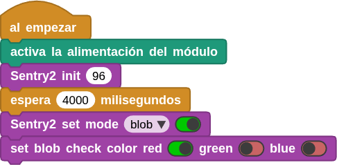

## **Objetivo**
Aprender sobre la función de detección de líneas del módulo AI Vision y utilizar CoCube para implementar la funcionalidad de seguimiento automático de líneas.

El video siguiente muestra la idea que se pretende programar.

<iframe width="560" height="315" src="https://www.youtube.com/embed/Qt4OLFEPJAI?si=i3I43mmXtxvO1N1e" title="YouTube video player" frameborder="0" allow="accelerometer; autoplay; clipboard-write; encrypted-media; gyroscope; picture-in-picture; web-share" referrerpolicy="strict-origin-when-cross-origin" allowfullscreen></iframe>

## **Materiales**
Robot CoCube, conector soporte para Sentry2, mapa de seguimiento de línea y ordenador ejecutando el IDE de MicroBlocks en cualquiera de sus versiones, estable instalada localmente o versiones online tanto estable como pilot. En cualquier caso tenemos que añadir las bibliotecas **CoCube**, **CoCube module** y **Sentry2 AI camera**.

El mapa de seguimiento de línea lo puedes descargar e imprimir en papel tamaño A3 en cualquiera de estos enlaces:

* [Versión original](../img/aux/mapa_siguelineas_original.pdf)
* [Versión en castellano](../img/aux/mapa_siguelineas_cast.pdf)

Hay que realizar la conexión de de dispostivos colocando el soporte para la Sentry2, con la cámara colocada, en el conector de expansión del CoCube. El conector con 4 cables hay que colocarlo en el conector I2C de la cámara.

## **Información de algoritmos de Sentry2**
### Introducción

  

Detecta si hay líneas en la imagen. Si es así, devolverá los dos extremos y el ángulo de inclinación de la línea. Se pueden detectar hasta 5 segmentos de línea simultáneamente. Si se trata de una curva, devolverá un segmento recto aproximado.

En el enlace siguiente se puede ver un video, que aunque está en chino, se puede llegar a entender el funcionamiento del algoritmo de detección de línea:

[Sentry2 Vision Sensor - Line Detection Algorithm IntroductionBilibilibilibili](https://www.bilibili.com/video/BV1de4y137QU/)

### Configuración de parámetros

  

En la interfaz de usuario, puedes configurar el rendimiento del algoritmo y el número de segmentos de línea detectados simultáneamente.

* **Rendimiento del algoritmo:**

Elige el rendimiento del algoritmo adecuado en función de los diferentes requisitos de la aplicación. Hay tres opciones: "Sensible (Sensitive)", "Equilibrado (Balance) y "Preciso (Accurate)".

En el modo sensible, responde mejor a los segmentos de línea pequeños. En el modo preciso, se ignorarán los segmentos de línea más pequeños. El modo predeterminado es el modo equilibrado.

* **Número de segmentos de línea:**

Puedes establecer el valor entre 1 y 5 segmentos de línea.

### Devolución de resultados

  

Después de detectar una línea, devuelve sus dos extremos y el ángulo de inclinación.

!!! Note "**Nota:**"
    La horizontal derecha es 0 grados, aumentando en sentido antihorario; la vertical hacia arriba es 90 grados, la izquierda horizontal es 180 grados, por lo general no se detectan ángulos hacia abajo.

Se pueden detectar hasta 5 segmentos de línea simultáneamente. Para distinguirlos en la interfaz de usuario, se marcan según el orden de los resultados utilizando cinco colores: "rojo, amarillo, verde, azul y morado".

  

Al leer los registros a través del controlador principal, se devolverán los siguientes datos:

|==**Resultado**==|==**Significado**==|
|:-:|---|
|1|Coordenada X del punto final de la línea (superior)|
|2|Coordenada Y del punto final de la línea (superior)|
|3|Coordenada X del punto inicial de la línea (inferior)|
|4|Coordenada Y del punto inicial de la línea (inferior)|
|5|Grados de la línea|

### Consejos de uso
1. El fondo y las líneas deben estar claramente diferenciados; por ejemplo, un fondo blanco con líneas negras. Si el fondo está recargado, es posible que se detecten líneas en él.
2. El grosor de las líneas debe ser moderado; ni demasiado fino ni demasiado ancho.
3. En general, al seguir líneas, el primer segmento es siempre el que está en la parte inferior de la pantalla, seguido de los segmentos ramificados.

### Explicación de los bloques necesarios
- **Inicialización de Sentry2**
Es un parámetro opcional que determina la dirección I2C del dispositivo. El valor por defecto es 96 (0x60) de entre el rango válido que va desde 96 (0x60) hasta 99 (0x63).

Antes de poder usar Sentry2, debes inicializarla mediante el bloque de la imagen, que por lo general, se coloca debajo de un bloque tipo sombrero "al empezar".

  

- **Establecer modo de Sentry2**

  

Debes establecer el modo en linea (line), es decir, el modo de reconocimiento de de líneas.

- **Resultados de las pruebas de Sentry2**

  

Antes de usar este bloque, debes asegurarte de que el modo de algoritmo de línea esté habilitado.

Este bloque es también el bloque utilizado para desencadenar la detección, y solamente después de utilizar este bloque se pueden obtener resultados de detección.

El resultado devuelto es el número de resultados reconocidos por el algoritmo de LINE actual.

El número de resultados se ve afectado por la configuración de parámetros del algoritmo correspondiente.

- **Sentry2 detección de atributos del objeto línea**

  

Devuelve los atributos del objeto de detección de línea ID, incluidos la coordenada X del punto final (alta), la coordenada Y del punto final (alta), la coordenada X del punto inicial (baja), la coordenada Y del punto inicial (baja) y el ángulo de inclinación de la línea.

## **Programación de CoCube siguelineas**

**&#x2460** Conecta el IDE de MicroBlocks al robot CoCube a través de cable USB o por medios inalámbricos. Coloca el accesorio con la cámara Sentry2 en el conector magnético delantero.

**&#x2461** Debes agregar las bibliotecas **Sentry2 AI camera**, **CoCube** y **CoCube module**.

**&#x2462** Configura "Line" como en la imagen siguiente:

  

**&#x2463** Debajo de un bloque sombrero "al empezar" coloca el bloque "activa la alimentación del módulo" para que la Sentry2 se alimente a través del conector I2C. A continuación inicializa la interfaz I2C y coloca una espera de 4 segundos para dar tiempo a que el módulo de la cámara se inicie correctamente y, a continuación, establece el modo de algoritmo de la cámara en modo line (linea) para detectar lineas.

  

**&#x2464** En primer lugar, debemos utilizar el bloque "Sentry2 detect mode", que determina si hay resultado en la detección.

  

Cuando "Sentry2 detect mode" es 1, se presentan por pantalla los 5 atributos de la detección de línea.

  

**&#x2465** Ahora, veamos cómo mantener CoCube en la línea en función de su posición y ángulo. Dado que CoCube utiliza un sistema de ruedas diferenciales, cuando se desvía de la línea, se debe ajustar la velocidad de las dos ruedas para corregir la dirección. Por lo tanto, debemos determinar cuándo realizar dicho ajuste, como se muestra en la siguiente figura:

  

1. En primer lugar, si la línea se encuentra a la izquierda, significa que CoCube se ha desviado hacia la derecha. Lo ideal es que CoCube vuelva al centro de la línea más cercana lo antes posible. Por lo tanto, restamos el centro de la pantalla (50) a bottomX y lo dividimos por un coeficiente proporcional para obtener el valor diferencial, que se define como la primera parte o sumando del error.
2. En segundo lugar, si el ángulo de la línea no es de 90 grados (es decir, si hay un giro en la línea), debemos girar para seguirla. Por tanto, se resta el ángulo obtenido del ángulo recto (90) y se divide por otro coeficiente proporcional para obtener el valor diferencial, definido como el segundo sumando del erro. La suma de estos dos errores nos da el valor del error para la rueda.
3. La velocidad final de la rueda izquierda es igual a la velocidad lineal (20 en este caso) más los errores, y la velocidad de la rueda derecha es igual a la velocidad lineal (20 en este caso) menos los errores.

El código es el siguiente:

  

!!! Note "Nota:"
    Aquí, los dos errores considerados adoptan la idea de retroalimentación negativa, de modo que ajustan la velocidad de la rueda según los errores reales para reducirlos.

**&#x2466** Para finalizar se implementa la detención del robot cuando se pulsa el botón B. Para que tenga efecto el frenado de las ruedas hay que detener previamente el resto de tareas o el robot seguirá moviendose.

  

El código completo lo vemos en la imagen siguiente y bajo la misma está el enlace de descarga del mismo.

  
**[Descargar el programa](../program/cocube/CoCube_siguelineas.ubp)**

## **Funcionamiento del siguelineas**
En el video siguiente se puede observar el funcionamiento del programa anterior:

<iframe width="560" height="315" src="https://www.youtube.com/embed/4ttUMYz1rQw?si=xUsGuAPtFcDmjUCZ" title="YouTube video player" frameborder="0" allow="accelerometer; autoplay; clipboard-write; encrypted-media; gyroscope; picture-in-picture; web-share" referrerpolicy="strict-origin-when-cross-origin" allowfullscreen></iframe>

