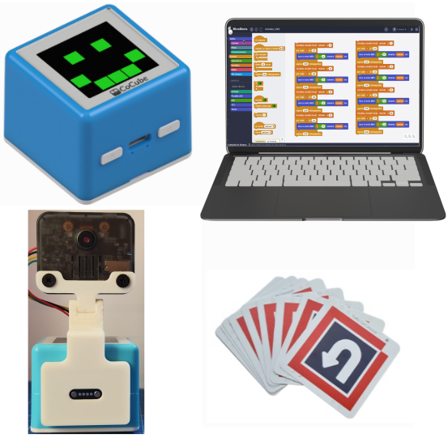
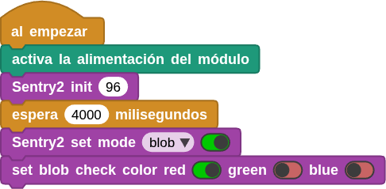
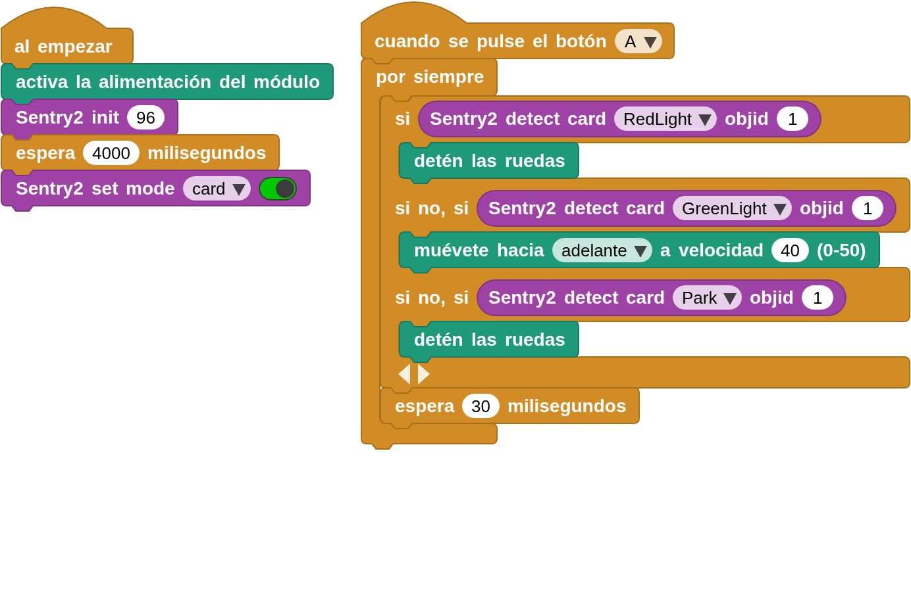
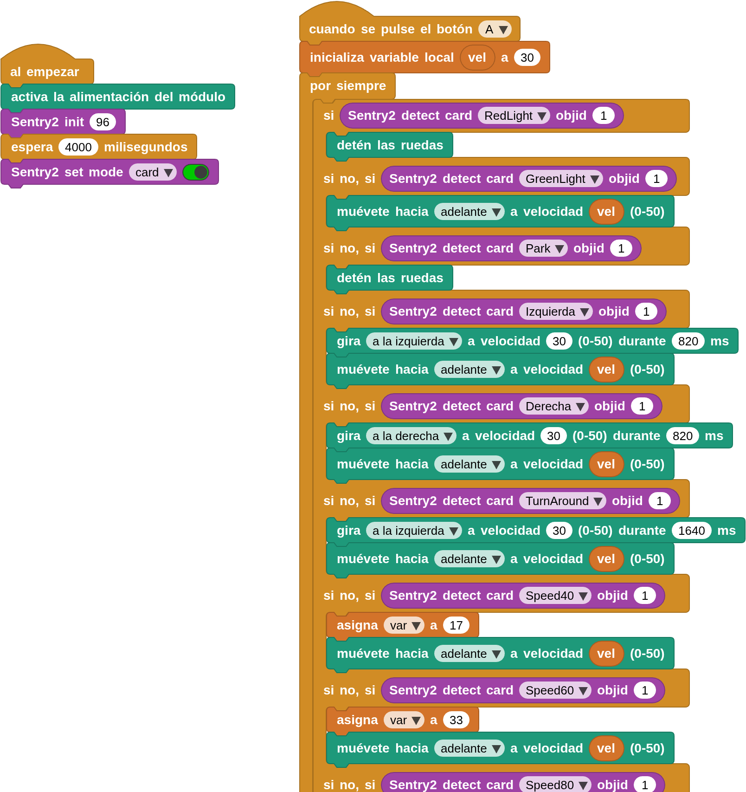

## **Objetivo**
Programa el robot CoCube para que reconozca las señales de tráfico (tarjetas que acompañan al kit) y realice automáticamente las acciones correspondientes, creando así un entorno de pruebas inteligente para el tráfico.

Durante el proceso, se aprende sobre la tecnología de inteligencia artificial en la visión de imágenes.

El video siguiente muestra la idea que se pretende programar.

<iframe width="560" height="315" src="https://www.youtube.com/embed/Um1ZYU-2KoY?si=CZfQYAnOj_tsyaNN" title="YouTube video player" frameborder="0" allow="accelerometer; autoplay; clipboard-write; encrypted-media; gyroscope; picture-in-picture; web-share" referrerpolicy="strict-origin-when-cross-origin" allowfullscreen></iframe>

## **Materiales**
Robot CoCube, conector soporte para Sentry2, tarjetas de tráfico del kit y ordenador ejecutando el IDE de MicroBlocks en cualquiera de sus versiones, estable instalada localmente o versiones online tanto estable como pilot. En cualquier caso tenemos que añadir las bibliotecas **CoCube**, **CoCube module** y **Sentry2 AI camera**.

Hay que realizar la conexión de de dispostivos colocando el soporte para la Sentry2, con la cámara colocada, en el conector de expansión del CoCube. El conector con 4 cables hay que colocarlo en el conector I2C de la cámara.

## **Información de algoritmos de Sentry2**
### Introducción

  

Identifica si hay patrones de tarjetas específicos en la imagen y devuelva información como las coordenadas de las tarjetas, el tamaño, las etiquetas de clasificación, etc. Incluye señales de tráfico, símbolos gráficos y números. Las etiquetas de clasificación se muestran en la tabla siguiente.

**Señales de tráfico**

|==**Etiqueta**==|==**Identif.**==|==**Significado**==|==**Etiqueta**==|==**Identif.**==|==**Significado**==|
|:-:|---|---|:-:|---|---|
|1|Forward|Adelante|2|Left|Izquierda|
|3|Right|Derecha|4|Turn Around|Cambio de sentido|
|5|Park|Aparcamiento|6|Green|Verde|
|7|Red|Rojo|8|Speed 40|Vel. máxima 40|
|9|Speed 60|Vel. máxima 60|10|Speed 80|Vel. máxima 80|

### Devolución de resultados

  

Este algoritmo admite el reconocimiento simultáneo de varias tarjetas. Las tarjetas giradas hasta 30 grados pueden reconocerse; las rotaciones excesivas no pueden reconocerse.

Al leer los registros a través del controlador principal, se devolverán los siguientes datos:

|==**Resultado**==|==**Significado**==|
|:-:|---|
|1|Coordenada X del centro del bloque de color|
|2|Coordenada Y del centro del bloque de color|
|3|Ancho del bloque 'w'|
|4|Alto del bloque 'h'|
|5|Etiquetas de clasificación|

### Consejos de uso
1. Este algoritmo puede detectar tarjetas a gran distancia, pero esta no será la situación de detección deseada por el usuario. Para solucionar este caso, se puede utilizar el "ancho de la tarjeta" para excluir aquellas tarjetas que se encuentren lejos. Por ejemplo, las acciones solo se activarán cuando el ancho de la tarjeta sea superior al 50%.
2. Cuando hay varias tarjetas en la imagen (por ejemplo, una fila de tarjetas), el orden de detección se basa en el punto central de la tarjeta, escaneando fila por fila desde la esquina superior izquierda (0,0), de arriba abajo y de izquierda a derecha.

### Explicación de los bloques necesarios
- **Inicialización de Sentry2**
Es un parámetro opcional que determina la dirección I2C del dispositivo. El valor por defecto es 96 (0x60) de entre el rango válido que va desde 96 (0x60) hasta 99 (0x63).

Antes de poder usar Sentry2, debes inicializarla mediante el bloque de la imagen, que por lo general, se coloca debajo de un bloque tipo sombrero "al empezar".

  

- **Establecer modo de Sentry2**

  

Debes establecer el modo en tarjeta (card), es decir, el modo de reconocimiento de tarjetas de señal de tráfico.

- **Resultados de las pruebas de Sentry2**

  

Antes de usar este bloque, debes asegurarte de que el modo de algoritmo de tarjeta esté habilitado.

Este bloque es también el bloque utilizado para desencadenar la detección, y solamente después de utilizar este bloque se pueden obtener resultados de detección.

El resultado devuelto es el número de resultados reconocidos por el algoritmo de tarjeta actual.

- **Sentry2 Tarjeta detectada**

  

Devuelve el atributo de etiqueta del identificador del objeto detectado. Este bloque determina si el objeto con el identificador 1 es una tarjeta de avanzar; si es así, devuelve True; de lo contrario, devuelve False.

- **Sentry2 detecta los atributos del objeto**

  

Devuelve los atributos del identificador del objeto detectado, incluida la coordenada 'X' central del parche de color, la coordenada 'Y' del centro del parche de color, la anchura del parche de color 'w', la altura 'h' del parche de color y la etiqueta.

Cada una de estas etiquetas corresponde a una categoría de tarjeta diferente (por ejemplo, luz roja, luz verde, números, etc.)

## **Programación de ejemplo base**

**&#x2460** Conecta el IDE de MicroBlocks al robot CoCube a través de cable USB o por medios inalámbricos. Coloca el accesorio con la cámara Sentry2 en el conector magnético delantero.

**&#x2461** Debes agregar las bibliotecas **Sentry2 AI camera**, **CoCube** y **CoCube module**.

**&#x2462** Debajo de un bloque sombrero "al empezar" coloca el bloque "activa la alimentación del módulo" para que la Sentry2 se alimente a través del conector I2C. A continuación inicializa la interfaz I2C y coloca una espera de 4 segundos para dar tiempo a que el módulo de la cámara se inicie correctamente y, a continuación, establece el modo de algoritmo de la cámara en modo card (tarjeta) para detectar la información de la tarjeta.

  

**&#x2463** En primer lugar, debemos utilizar el bloque "Sentry2 detectd card **...** objid ##", que determina si el resultado de la detección de la etiqueta de la tarjeta con el número de secuencia de identificación "##" es "**".

  

Para facilitar el inicio, podemos configurar la lógica para que comience a comprobar después de pulsar el botón A. Ahora, solo hay que utilizar una combinación de bucles y sentencias condicionales para implementar diferentes procesamientos lógicos para diferentes etiquetas de tarjeta, como se muestra en la figura siguiente, que incluye el manejo de la parada con semáforo en rojo, el avance con semáforo en verde y el estacionamiento:

  
**[Descargar el programa](../program/cocube/CoCube_trafico_ini.ubp)**

## **Programa para seguir las señales de tráfico**

**&#x2460** Conecta el IDE de MicroBlocks al robot CoCube a través de cable USB o por medios inalámbricos.

**&#x2461** Debes agregar las bibliotecas **Sentry2 AI camera**, **CoCube** y **CoCube module**.

**&#x2462** Debajo de un bloque sombrero "al empezar" coloca el bloque "activa la alimentación del módulo" para que la Sentry2 se alimente a través del conector I2C. A continuación inicializa la interfaz I2C y coloca una espera de 4 segundos para dar tiempo a que el módulo de la cámara se inicie correctamente y, a continuación, establece el modo de algoritmo de la cámara en modo card para el reconocimiento de tarjetas.

**&#x2463** Bajo un bloque sombrero "cuando se pulse el botón..." se comprueba continuamente si se detecta alguna de las tarjetas. Si es cierto el robot realiza la tarea correspondiente a la tarjeta detectada.

  
**[Descargar el programa](../program/cocube/CoCube_trafico.ubp)**

