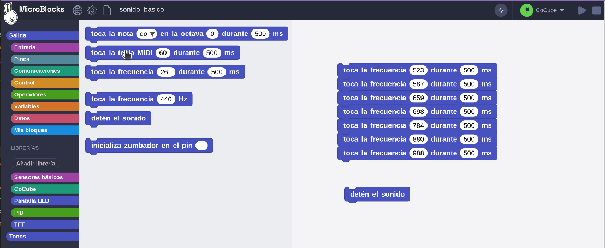
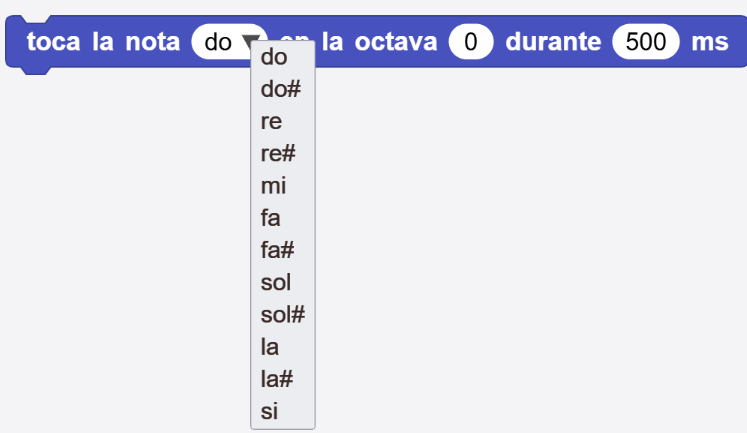
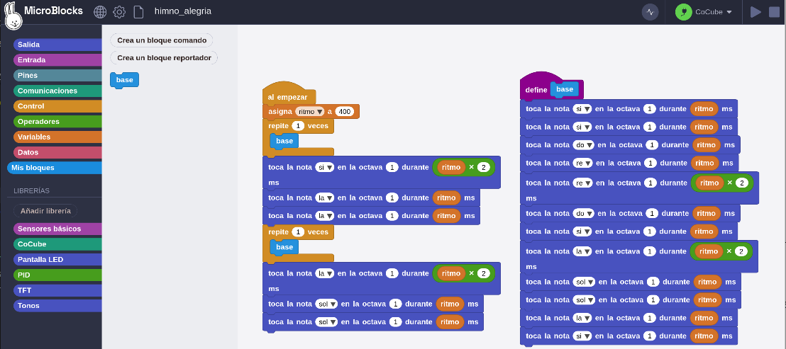
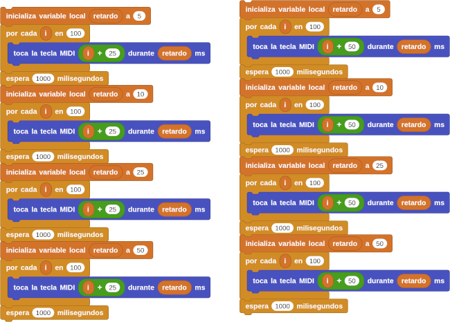
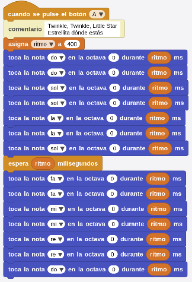

## <FONT COLOR=#007575>**Objetivo**</font>
Programar el robot CoCube para que reproduzaca sonidos y melodias.

## <FONT COLOR=#007575>**Materiales**</font>
Robot CoCube y ordenador ejecutando el IDE de MicroBlocks.

<center>


</center>

## <FONT COLOR=#007575>**Programación**</font>
El robot CoCube está equipado con un zumbador que se puede programar para emitir sonidos de diferentes tonos y ajustar la duración del tono y el intervalo de tiempo para completar la composición y la reproducción.

**1.** **Conectar dispositivos**: conecta el IDE de MicroBlocks al robot CoCube mediante medios cableados o inalámbricos.

**2.** **Localiza los bloques**: busca el bloque "toca la frecuencia 261 durante 500 ms" en la liberia "Tonos" y arrástralo al espacio de trabajo.

**3.** **Ejecutar el programa**: haz clic con el botón izquierdo en el bloque. Cuando se enciende un halo verde alrededor de los bloques, significa que el programa se está ejecutado con éxito y se puede escuchar el zumbador del robot CoCube, el sonido cesará transcurridos 0,5 segundos.

**4.** **Ajusta el tono**: cambia el número de tonos y la duración para obtener sonidos de diferentes tonos.

**5.** **Notas musicales**: a continuación tenemos un conjunto de frecuencias de notas y su correspondencia de frecuencia en una determinada octava: Do (260), Re (290), Mi (330), Fa (350), Sol (392), La (440) y Si (494).

Es muy conveniente consultar lo referente a sonido en el apartado "Antes de" dado al principio.

Arrastra varios bloques y modifica la frecuencia y la duración de cada uno para completar una melodia.

**6.** **Detener el sonido**: Para detener el sonido del zumbador, utiliza el bloque "detén el sonido". Simplemente haz clic en el bloque en el área de bloques o arrástralo al área de trabajo y haz clic en él, y CoCube dejará de reproducir el sonido inmediatamente.

<center>

  
*[Descargar programa](../program/cocube/sonido_basico.ubp)*

</center>

## <FONT COLOR=#007575>**Funciones avanzadas de sonido**</font>
Es muy tedioso tener que buscar el contraste entre notas y frecuencias tú mismo. ¿Hay alguna manera más fácil? En MicroBlocks se ofrecen dos métodos sencillos.

### <FONT COLOR=#AA0000>Notas</font>
En música, las notas c, d, e, f, g, a y b se pueden usar para representar Do-Re-Mi-Fa-Sol-Si. Un sostenido (♯) eleva el tono en un semitono, y las octavas (0, 1, 2…) indican tonos graves, medios, agudos, etc.

<center>

  

</center>

El programa siguiente es un intento de reproducción de una parte del Himno de la alegria.

<center>

  
*[Descargar programa](../program/cocube/himno_alegria.ubp)*

</center>

### <FONT COLOR=#AA0000>Melodias MIDI</font>
En un teclado MIDI, el número de nota MIDI corresponde al tono de la música y se utiliza principalmente en la producción de música digital y la comunicación entre instrumentos musicales.

MIDI (Musical Instrument Digital Interface) se traduce por "Interfaz Digital de Instrumentos Musicales".

Por ejemplo, 60 representa el do central del piano, 61 representa si bemol y 62 representa do.

El programa siguiente crea un efecto musical:

<center>

  
*[Descargar programa](../program/cocube/melodias_MIDI.ubp)*

</center>

### <FONT COLOR=#AA0000>Politonos</font>
El formato [RTTTL](https://en.wikipedia.org/wiki/Ring_Tone_Text_Transfer_Language) (del inglés, Ring Tone Text Transfer Language) fue desarrollado por Nokia para codificar tonos de llamada a teléfonos móviles. El formato RTTTL es una cadena dividida en tres secciones: encabezado (nombre o título), valor predeterminado y datos. Por ejemplo, la siguiente cadena de texto se corresponde con la Intro de Donkey Kong:

*d=4,o=5,b=140:8a#,8p,8d6,16p,16f.6,16g.6,16f.6,8a#,8p,8d6,16p,16f.6,16g.6,<br>16f.6,8a#,8p,8d6,16p,16f.6,16g.6,16f.6,8a#,8p,8d6,16p,16f.6,16g.6,16f.6*</br>

Añadimos la libreria "**Politonos**" a nuestro entorno y nos encontramos con los siguientes bloques:

* . Reproduce la cadena de tono de llamada indicada.
* . Devuelve el nombre del tono de llamada que se está reproduciendo actualmente.

Para reproducir una melodia simplemente la copiamos en el bloque ```toca el politono```.

Existen páginas de donde se pueden descargar tonos, o incluso podemos hacerlo nosotros mismos. A continuación ponemos algunos enlaces:

* [RTTTL Ringtone Downloads](https://picaxe.com/rtttl-ringtones-for-tune-command/) de Picaxe.
* Colecciones de [ArcadeTones](http://arcadetones.emuunlim.com/) clasificados por temas.
* Archivo [NokringTunes.txt](http://microblocks.fun/mbtest/NokringTunes.txt) que contiene más de once mil melodías en formato Nokring.

Una vez descargado lo abrimos y buscamos la melodia para copiar y pegar en el bloque.

<font size="5"><FONT COLOR=#0000FF><b><u>Información complementaria</u></b></font color></font size>

Ya hemos visto como añadir la librería politonos, enlaces para obtenerlos y el uso de los mismos en MicroBlocks, pero vamos a profundizar un poco mas sobre el tema.

El formato RTTTL es una cadena dividida en tres partes: nombre, valor por defecto y datos.

* **nombre**. Es una cadena que describe el nombre del tono de llamada. En principio su longitud máxima es de 10 caracteres y no puede contener el signo de dos puntos (:).
* **valor por defecto**. Lo forman un conjunto de valores separados por comas que son los que deben cumplirse durane la ejecución del tono de llamada. Cada valor es una clave a la que se asigna con una igualdad un valor, siendo los nombre posibles: **D** (duración), **o** (octava) y **B** (ritmo o tempo)
* **datos**. Es un conjunto de cadenas de caracteres separadas por comas, estando cada cadena formada por una *duración*, un *tono*, una *octava* y opcionalmente *puntos* que aumentan la duración de la nota a la mitad.

Un ejemplo de tono RTTTL puede ser:

```Abba - Money Money Money: d=4,o=5,b=112:8e7,8e7,8e7,8e7,8e7,8e7,16e6,16a6,16c7,16e7,8d#7,8d#7,8d#7,8d#7,8d#7,8d#7,16f6,16a6,16c7,16d#7,d7,8c7,8a6,8c7,c7,2a6,32a6,32c7,32e7,8a7```

donde se pueden distinguir facilmente las tres partes separadas por dos puntos (:):

* **nombre**. Abba - Money Money Money.
* **valor por defecto**. d=4,o=5,b=112 (d = duración; o = octava y b = tempo o ritmo). Mas adelante se describen mejor estos conceptos.
* **datos**. Las notas separadas por comas y formadas por una duración, una nota [a (La), b (Si), c (Do), d (Re), e (Mi), f (Fa) o g (Sol)] y la indicación de la octava, que si no se indica se aplica el valor predeterminado.

La duración de las notas es:

* **1** - nota entera
* **2** - media nota
* **4** - cuarto de nota
* **8** - octavo de nota (octava)
* **16** - dieciseisavo de nota
* **32** - treintaidosavo de nota

Los tonos pueden ser:

* **P** – descanso o pausa
* **A** – A (La)
* **A#** – A♯ B♭ (La#/Si♭)
* **B** – B/C♭ (Si/Do♭)
* **C** – C (Do)
* **C#** – C♯/D♭ (Do♯/Re♭)
* **D** – D (Re)
* **D#** – D♯/E♭ (Re♯/Mi♭)
* **E** – E/F♭ (Mi/Fa♭)
* **F** – F/E♯ (Fa/Mi♯)
* **F#** – F♯/G♭ (Fa♯/Sol♭)
* **G** – G (Sol)
* **G#** – G♯/A♭ (Sol♯/La♭)

En el formato RTTTL se permiten octavas comenzando desde la A por debajo del do medio y subiendo cuatro octavas. Esto se debe a la imposibilidad de los teléfonos móviles para reproducir ciertos tonos de forma audible. Las octavas están numeradas desde el tono más bajo hasta el tono más alto de 4 a 7. La octava debe dejarse fuera de la notación en el caso de un descanso o pausa en el patrón.

En el ejemplo siguiente suena un politono u otro dependiendo del botón que pulsemos en CoCube.

<center>

  
[Descargar programa](../program/cocube/ejem_politonos.ubp)

</center>

## <FONT COLOR=#007575>**Reto: Reproducir canción con CoCube**</font>
Utilizar Cocube para reproducir "Twinkle, Twinkle, Little Star" (Estrellita dónde estás).

El programa sería el siguiente:

<center>

  
[Descargar programa](../program/cocube/TwinkleLittleStar.ubp)

</center>
