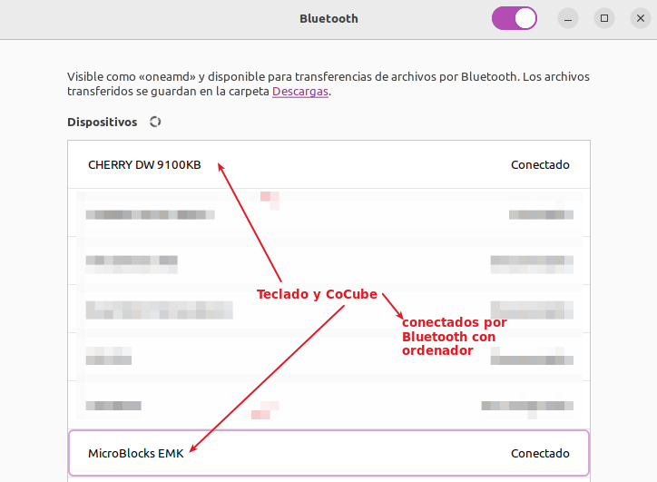
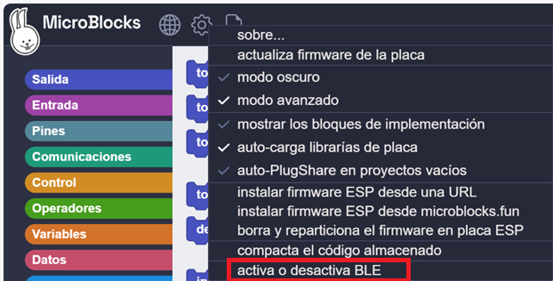
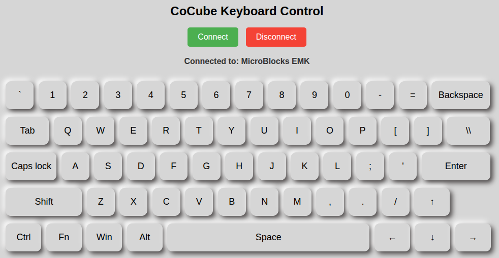
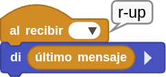
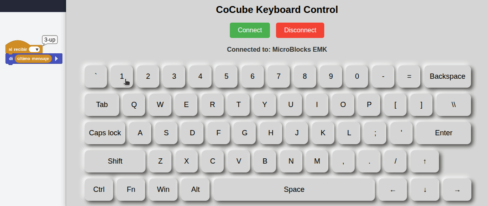
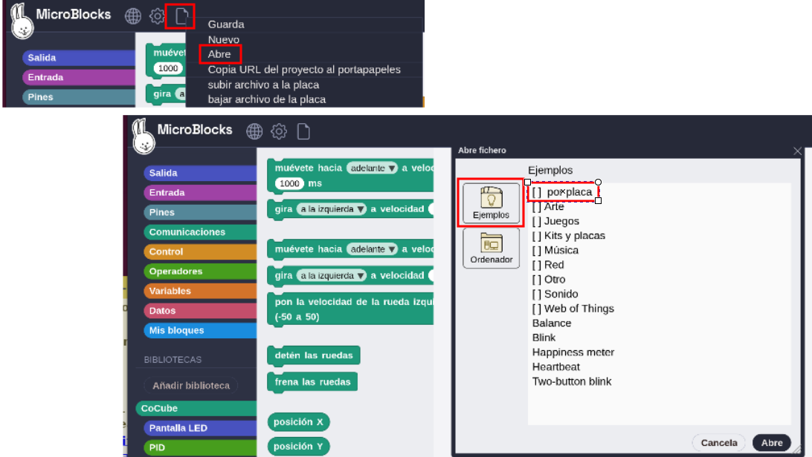
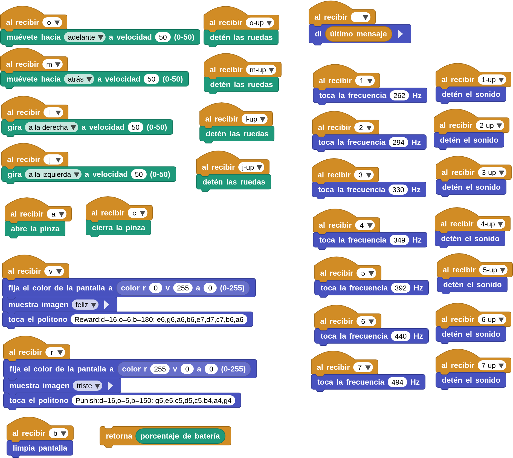
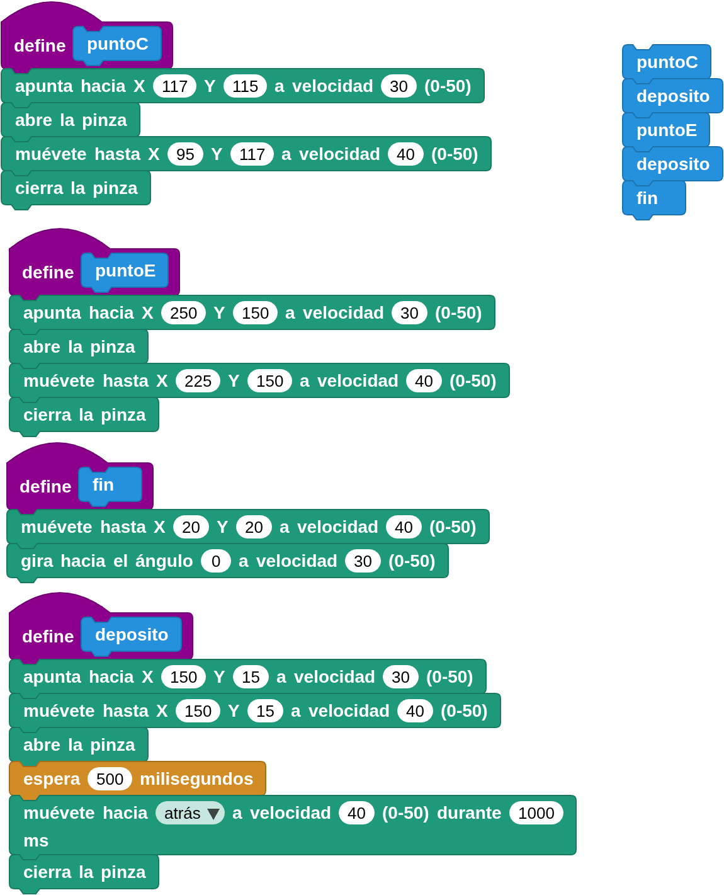

## **Objetivo**
Programación del robot CoCube para ser controlado desde un teclado.

## **Materiales**
Robot CoCube, pinza con servomotor y ordenador ejecutando el IDE de MicroBlocks.

## **Programación**
Se trata de utilizar las señales de un teclado físico u online para controlar el robot CoCube mediante la pulsación de teclas, logrando así el control remoto del mismo.

Para el funcionamiento con teclado físico se requieren ciertas condiciones que es necesario aclarar. En el caso que nos ocupa se utiliza un CoCube con nombre **EMK**, un teclado Cherry conectado por Bluetooth a un ordenador en el que se ejecuta Linux.

!!! Note "**Aviso:**"
    Las pruebas que siguen a continuación se han realizado utilizando MicroBlocks v2.0.55 con Firmware v336. El IDE utilizado es versión pilot online.

**1.** **Conexionee con ordenador**: la primera condición es que ambos dispositivos estén conectado con el ordenador via Bluetooth:

**2.** **Activar o desactivar BLE**: si es necesario activa la opción de la imagen siguiente.

**3.** **Conectar dispositivos**: conecta el IDE de MicroBlocks al robot CoCube mediante medios inalámbricos. Coloca el módulo servo con pinza en el robot CoCube.

**4.** **Acceso a web teclado**: entra en la página [https://keyboard.cocube.fun/](https://keyboard.cocube.fun/) para controlar el robot desde esa web. Conecta el teclado online con el dispositivo CoCube.

**5.** **Personalización de teclas**: Puedes personalizar las teclas para implementar el control mediante teclado. En prinicpio crea un programa que utilice los bloques "al recibir" y "di" y "último mensaje" para ver los nombres de los eventos del teclado al pulsar y soltar cualquier tecla. Estos nombre serán los que utilicemos en un programa posterior. El programa es el siguiente:

  
***Arrastra imágen al IDE de MicroBlocks para cargar el programa***

A continuación vemos su funcionamiento con el teclado online.

## **Reto: Control de CoCube mediante teclado**
Carga el programa de ejemplo que encontrarás en:

Archivos -> Abre -> Ejemplos -> Por placa -> CoCube -> CoCube KeyBoard Control

Partiendo del ejemplo de referencia que aparece en la Wiki, se realiza una personalización de las teclas, quedando el programa como se ve en la imagen siguiente:

  
[Descargar programa](../program/cocube/ControlCoCubeTeclado.ubp)

A continuación vemos el funcionamiento del programa reflejado en el gif animado sobre el teclado online. La pulsación de teclas se refleja en la parte inferior derecha.

  

## **Reto: Recogedor de objetos**
Sitados dos objetos en los puntos C y E del CoMaps laberinto, CoCube se orientará hacia cada punto (primero el C) se dirigirá al mismo con la pinza del servo abierta, la cerrará y trasladará el objeto recogido fuera del tablero por la zona de entrada al laberinto. Una vez sacado el primer objeto hará lo mismo con el segundo y finalmente se trasladará al punto A quedando con una orientación de cero grados.

El programa sería el siguiente:

  
[Descargar programa](../program/cocube/recoger_objetos.ubp)

El funcionamiento lo vemos a continuación:

<iframe width="560" height="315" src="https://www.youtube.com/embed/jTPq0mf2Po4?si=CDco6bosFRKISNVS" title="YouTube video player" frameborder="0" allow="accelerometer; autoplay; clipboard-write; encrypted-media; gyroscope; picture-in-picture; web-share" referrerpolicy="strict-origin-when-cross-origin" allowfullscreen></iframe>

