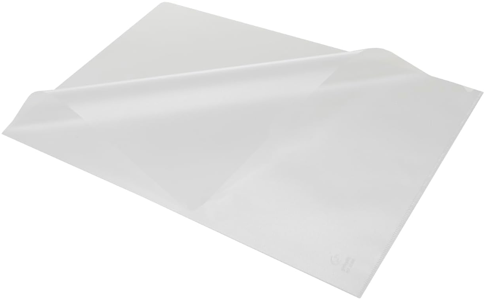
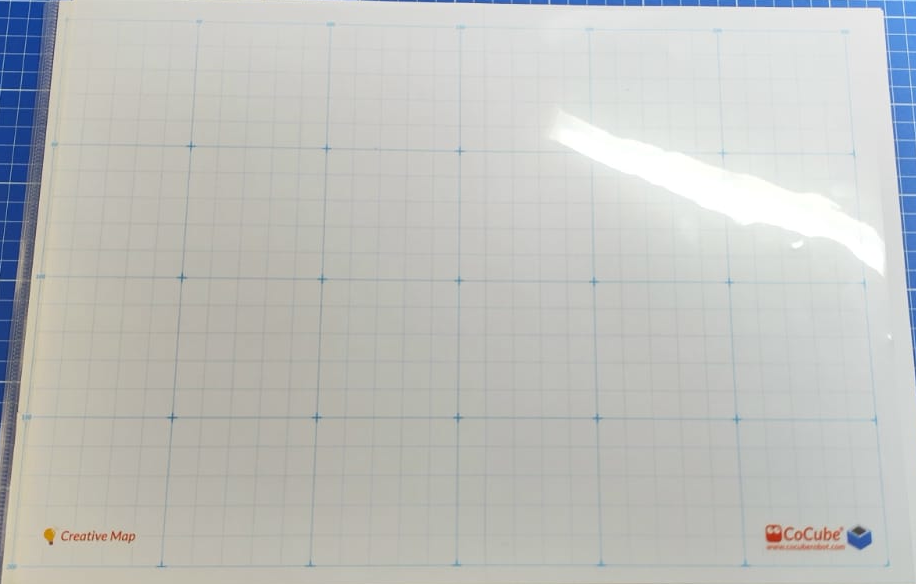
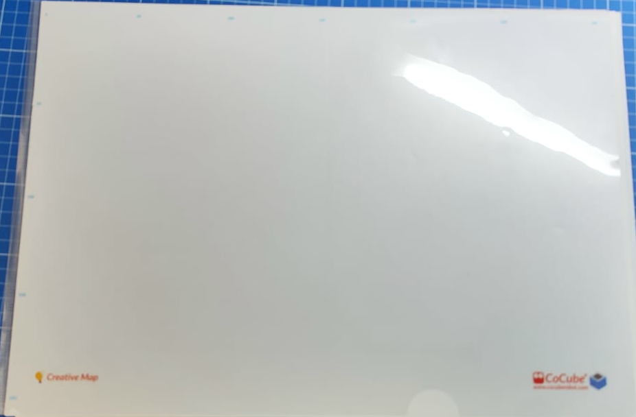
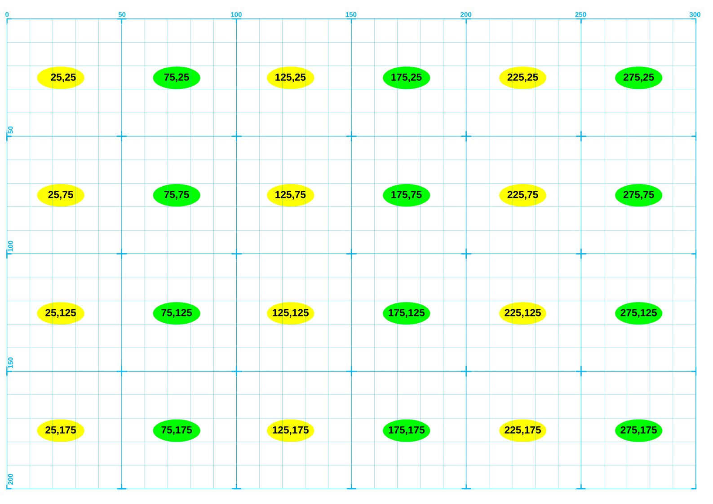
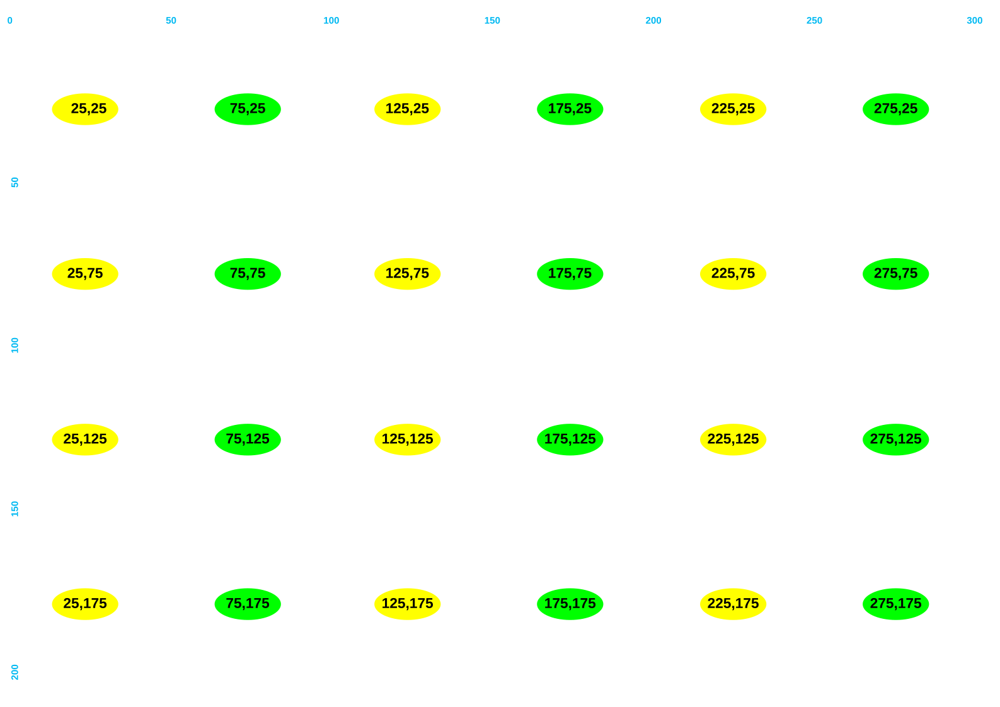
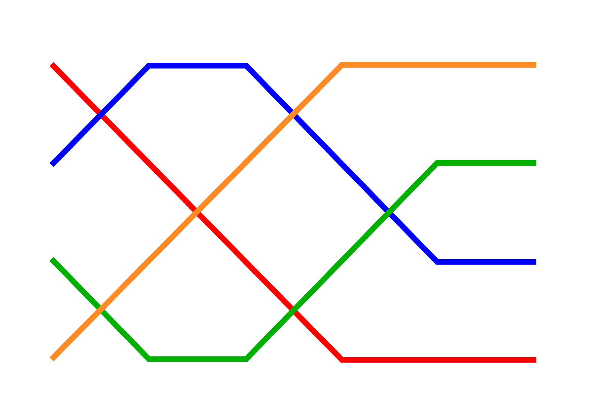
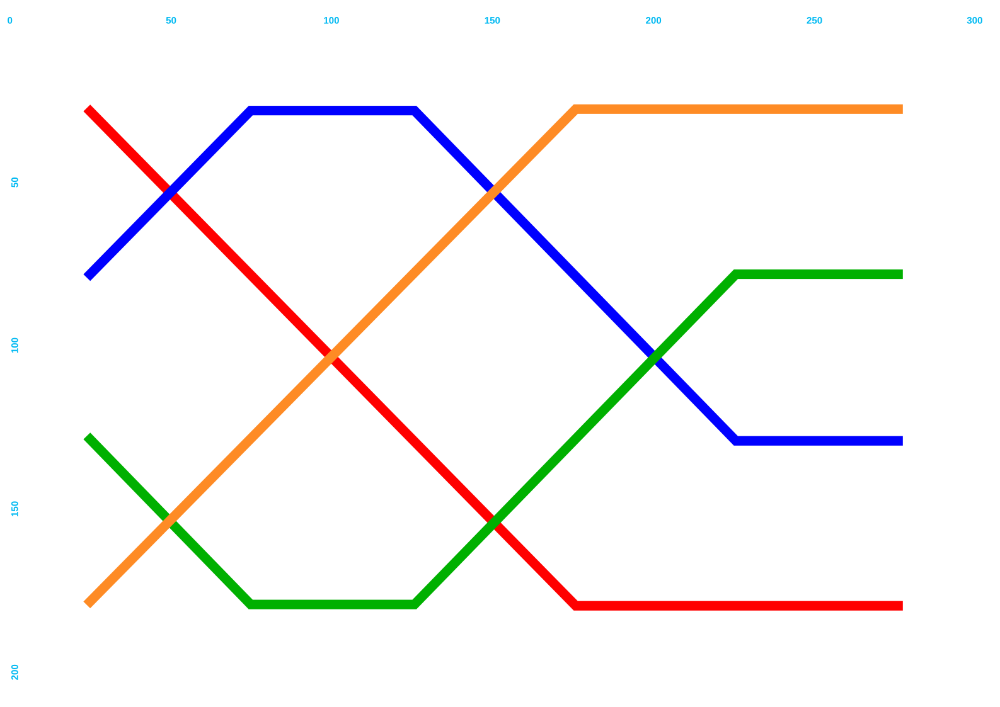
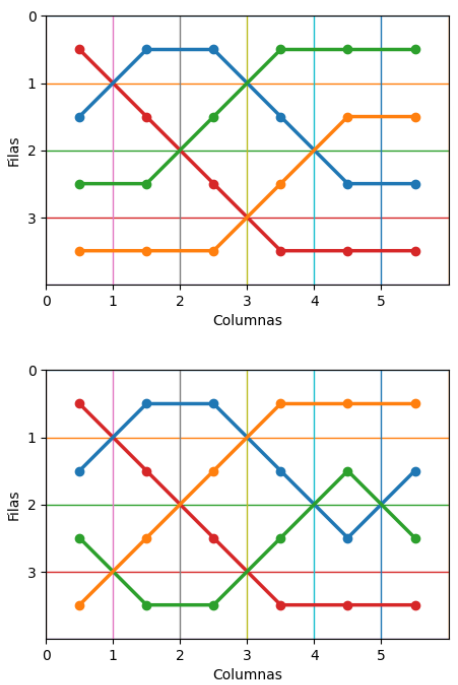
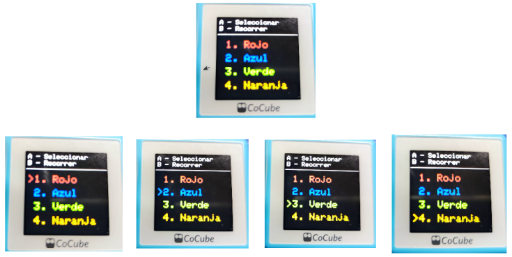
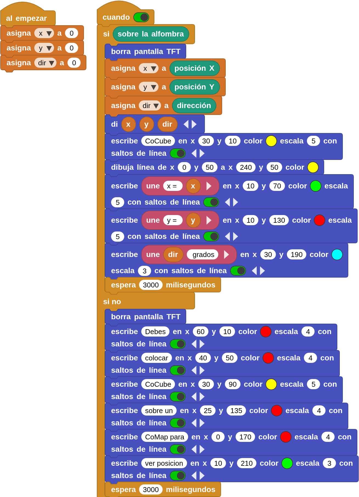

## **Introducción**
Se trata en realidad de dos CoMaps, uno en cada lámina, impresos en papel transparente montados sobre carpeta tipo dosier (imagen siguiente) de tamaño A3 con apertura superior y lateral.

  

En una de sus caras lleva superpuesta la cuadricula de coordenadas detallada, tal y como vemos en la imagen siguiente:

  

En la otra cara solamente están visibles los valores de las coordenadas:

  

No hay disponibles archivos para su descarga y se entiende que en un futuro serán comercializados.

Este elemento nos va a permitir dibujar cualquier tipo de tapete para jugar con CoCube. Dicho dibujo puede ser realizado tanto a mano alzada, con lápices de colores, como mediante software de diseño para su posterior impresión. Si se dibuja con lápices de colores es importante que los mismos no contengan carbono para evitar interferencias con el patrón de micropuntos. Este punto es bastante fácil de cumplir dado que en Europa, en los lápices de colores, sus minas suelen estar hechas a base de ceras y aceites exentas de carbono.

A continuación se muestra un gráfico con las coordenadas centrales de cada celda definida para el caso del CoMap **CON** rejilla.

  

A continuación se muestra un gráfico con las coordenadas centrales de cada celda definida para el caso del CoMap **SIN** rejilla.

  

Ambos gráficos pueden servir de guía para el desarrollo de diferentes retos.

## **Recorrer trazados**
Se trata de introducir en el CoMap tipo dosier, orientado a cualquiera de sus lados, el siguiente diseño:

  

Sobre un CoMap formado por 4 filas y seis columnas se han trazado los cuatro caminos de la imagen anterior, cumpliendo las siguientes condiciones:

1. Cada camino avanza de izquierda a derecha (una celda por columna).
2. Ningún camino tiene más de 3 celdas consecutivas en la misma fila.
3. Los caminos pueden cruzarse.
4. La unión de los 4 caminos cubre las 24 celdas (sin dejar ninguna libre).
5. Cada fila inicial es distinta.
6. Cada camino tiene su color y se trazan pasándo por los centros de las celdas

El conjunto con el CoMap con solo coordenadas tiene el aspecto siguiente:

  

Y para el cajo del CoMap de rejilla el siguiente:

  

Existe un número elevado de posibles combinaciones para crear recorridos que el lector puede experimentar. A continuación se muestran dos variaciones:

  

### Programa
!!! Warning "Aviso"
    Para que el programa funcione correctamente hay que añadir las bibliotecas PID y servomotor si no están ya agregadas

Se trata de un sencillo programa que permite escoger uno de los caminos utilizando el botón A y hacer que CoCube recorra dicho camino al pulsar el botón B. Una vez finalizado el recorrido realiza una espera de un segundo y medio y se mueve al centro del tablero (coordenadas 150,100) y se coloca en un ángulo de 180 grados.

La imagen siguiente muestra la pantalla inicial y las sucesivas pulsaciones del botón A.

  

El programa es el siguiente:

  
**[Descarga programa caminos.ubp](../program/cocube/caminos.ubp)**

En el video siguiente podemos ver el funcionamiento del programa anterior con CoCube conectado por Bluetooth y accionando los botones desde el IDE de Microblocks.

### Resultados

<iframe width="840" height="472" src="https://www.youtube.com/embed/iZxsYdf3P74?si=SU98Dmtb0xXCJyOu" title="YouTube video player" frameborder="0" allow="accelerometer; autoplay; clipboard-write; encrypted-media; gyroscope; picture-in-picture; web-share" referrerpolicy="strict-origin-when-cross-origin" allowfullscreen></iframe>

