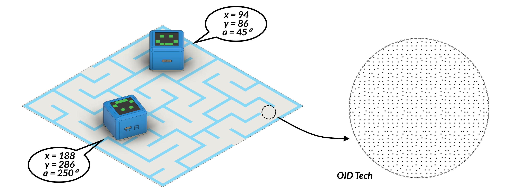
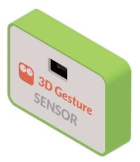
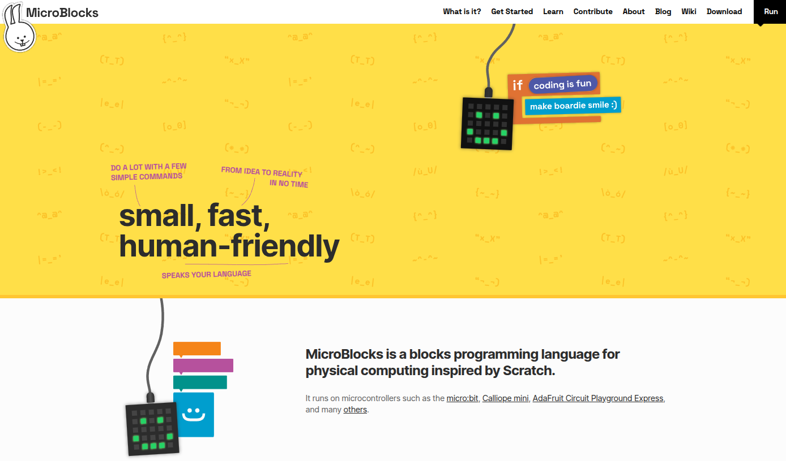
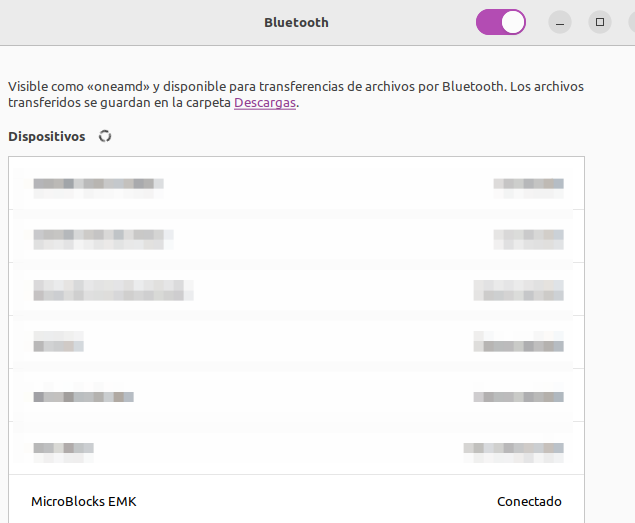
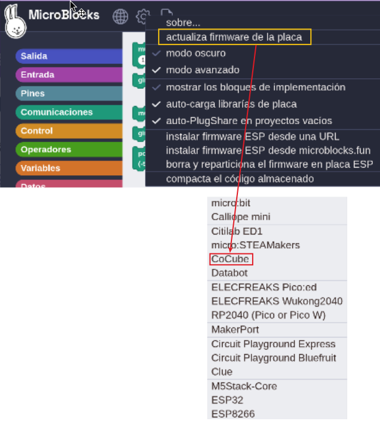
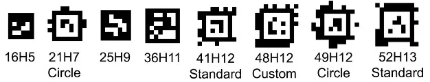

En esta web vamos a encontrar contenidos sobre CoCube, un robot educativo de escritorio que incorpora inteligencia artificial. CoCube es un robot muy pequeño que integra comunicación inalámbrica, pantalla, interacción por voz y otras funciones. Incorpora una batería que le permite moverse con flexibilidad.

  

CoCube es un robot educativo de escritorio que incorpora inteligencia artificial, desarrollado conjuntamente por un equipo de estudiantes de máster y doctorado de las universidades Shanghái Jiao Tong y Fudan, con el objetivo de acercar la inteligencia artificial a los jóvenes y crear una plataforma creativa llena de interactividad, logros y diversión. CoCube estimula la curiosidad y la creatividad de los estudiantes al involucrarlos en el diseño de robots de IA, desde la programación simple hasta la construcción de sistemas interactivos complejos, y les ayuda a convertir sus ideas e inspiraciones en realidad.

Información basada en:

* [CoCube](https://www.cocubefun.com/)
* [Wiki CoCube](https://wiki.cocube.fun/)

Los contenidos que se exponen en este apartado son una adaptación y ampliación de los ofrecidos en los enlaces de referencia.

## **CoCube**
<b>CoCube es una plataforma modular múlti-robot de sobremesa para la educación y la investigación</b>

CoCube ha sido desarrollado por:

Shuai Liang$^{(1,2,4)}$, Songyi Zhu$^{(2,4)}$, Zhonghan Tang$^{(2)}$, Chenhui Li$^{(2)}$, Wenjie Wu$^{(3)}$, Jialing Han$^{(1)}$, Zemin Lin$^{(4)}$, Zhongrui You$^{(2)}$, John Maloney$^{(3)}$, Bernat Romagosa$^{(3)}$, Bin Zhao$^{(2)}$, Zhigang Wang$^{(2)}$, Zhinan Zhang$^{(4)}$, Xuelong Li$^{(2,5)}$

$^{(1)}$ Universidad de Fudan, , $^{(2)}$ Laboratorio de IA de Shanghái, , $^{(3)}$MicroBlocks, $^{(4)}$ Universidad Jiao Tong de Shanghái, $^{(5)}$ Instituto de Inteligencia Artificial y China Telecom Corp Ltd.

  

**Plataforma CoCube**: El hardware incluye

* robots CoCube
* CoModules, que son módulos para ampliar la funcionalidad. Están basados en conectores con pines pogo accionados por resorte dotados de imanes que facilitan la conexión y desconexión. El nombre pogo se debe a su parecido con los palos de pogo o palos para saltar en una posición de pie con la ayuda de un resorte.
* CoMaps, que son mapas para la localización del robot en un tablero basados en el método de posicionamiento que utiliza tecnologia de identificación óptica (OID).
* CoTags, que son etiquetas para la interacción.

El software se desarrolla en la plataforma MicroBlocks y es compatible con múltiples APIs avanzadas.

  

## **Aspectos destacados**
* CoCube es un robot de escritorio muy pequeño que integra comunicación inalámbrica, pantalla, interacción por voz y otras funciones. Incorpora una batería de larga duración que le permite moverse con flexibilidad. Su programación es sencilla y se puede disfrutar en cualquier momento y lugar.

  

* CoCube cuenta con comunicación inalámbrica, pantalla LCD de 240x240 px0, movimientos precisos a través de sus ruedas, botón de encendido y apagado, altavoz para emitir sonidos, dos botones, un LED indicador de carga (rojo) o de encendido (verde), un conector magnético para módulos de expansión y posicionamiento exacto mediante camara.

  

* Gracias a su interfaz magnética frontal, CoCube puede expandirse con módulos de detección, actuadores, visualización e inteligencia artificial. El conector es de tipo plug and play, por lo que permite satisfacer muchas necesidades creativas y personalizadas.

  

* El robot CoCube puede ubicarse con precisión en mapas CoMaps, lo que brinda grandes posibilidades para el control preciso de un robot y la colaboración en grupos de robots. Esto permite experimentar con el trabajo en equipo y la programación creativa.

  

* **CoMaps** utiliza tecnología de identificación óptica (OID) para crear mapas de codificación por micropuntos que se pueden imprimir en papel normal, lo que proporciona a los robots CoCube capacidades de posicionamiento de alta precisión y fáciles de implementar.

  

* El robot CoCube se puede programar mediante la plataforma de programación gráfica MicroBlocks, que ya se ha descrito en la sección [ESP32 micro:STEAMakers](https://fgcoca.github.io/GuiasFundamentales/microSTEAMakers/contmicroSM/). MicroBlocks admite programación interactiva, depuración en tiempo real y conexión y desconexión en cualquier momento, lo que permite el funcionamiento autónomo. El sistema utiliza MicroBlocks para el desarrollo de firmware y bibliotecas de bloques, con interfaces de comunicación para APIs avanzadas que permiten realizar tareas más complejas.

  

## **Especificaciones técnicas**
### Robot CoCube

  

|Especificación|Parámetro|
|---|---|
|Microcontrolador|ESP32 Xtensa® 32-bit LX6 Procesadores de núcleo simple/dual|
|WiFi|802.11 b/g/n (2.4Ghz)|
|Bluetooth|Bluetooth V4.2 BR/EDR norma BLE|
|Movimiento|Chasis diferencial de doble vía con una velocidad máxima de movimiento de 50 unidades/s|
|Posicionamiento|Velocidad de fotogramas elevada, posicionamiento exacto a nivel milimétrico y resolución angular de 1°|
|Pantalla TFT|Pantalla a color de 1.54 pulgadas y resolución de 240x240|
|Botones|El botón de encendido se encuentra en la parte inferior y debe mantenerse presionado durante 3 segundos para encenderlo, mientras que los botones A y B se encuentra en la parte trasera del chasis|
|Zumbador|El zumbador que incorpora CoCube es de tipo pasivo|
|Interfaz magnética|Interfaz de 4 pines de sujeción magnética (I2C + I/O + UART),5V / 600mA|
|Bateria de litio|7.4V / 450mAh|
|Tensión de carga|Interfaz tipo C, 5V / 1.2A|
|Duración batería|Sin límite en el modo de programación por cable, aproximadamente 2 horas en el modo de programación inalámbrica por Bluetooth, aproximadamente 1 hora en el modo Wi-Fi|
|Dimensiones|45 × 45 × 38 mm|
|Peso|63g|

### Mapas de ubicación CoMaps
Los robots CoCube pueden obtener ubicaciones y ángulos precisos en los mapas CoMaps.

Para un CoMap estándar, el tamaño total es de aproximadamente un formato A3 y está diseñado con variedad de temas, como laberintos, circuitos para conducción, fútbol, etc.

Las coordenadas de la esquina superior izquierda del mapa son (0,0), las coordenadas de la esquina inferior derecha son (300,200), el eje X va de izquierda a derecha (0 ~ 300) y el eje Y va de arriba a abajo (0 ~ 200).

El robot está orientado 0 grados en la dirección positiva del eje Y y 180 grados cuando está orientado en la dirección negativa del mismo eje. Además, el ángulo de rotación aumenta en sentido contrario a las agujas del reloj.

Las líneas punteadas se imprimen en el mapa cada 50 unidades, lo que permite localizar rápidamente la ubicación de las coordenadas.

Los mapas de ubicación de CoMaps admiten costuras extendidas para un tamaño mayor del rango de posicionamiento.

Para obtener más información sobre los mapas de ubicación de CoMaps o los requisitos de personalización de mapas grandes, consulta con el equipo de CoCube.

### Módulo de expansión CoModules
El robot CoCube se puede ampliar fácilmente a través de conectores magnéticos con diferentes módulos. Actualmente, se admiten los siguientes:

|Módulo|Imagen|Funciones y aplicaciones|
|---|---|---|
|Pinza servo||Las pinzas se pueden dotar de piezas de agarre de silicona para que sean antidelizantes. Aplicable a logistica y escenarios de competición |
|ToF (tiempo de vuelo)||Mediante la emisión de un láser infrarrojo, mide el tiempo que tarda la luz en llegar a un objeto y reflejarse, y así obtiene datos precisos sobre la distancia. Tiene una excelente adaptabilidad a la luz y no se ve afectado por la reflectividad del objetivo, por lo que funciona de manera estable en diversas condiciones de iluminación y escenarios de uso|
|Panel WS2812||Se trata de una matriz de 6x8 LEDs RGB controlables individualmente y con una amplia variedad de colores y efectos dinámicos. Se puede programar y controlar fácilmente a través de un microcontrolador o un controlador dedicado y permite el ajuste píxel a píxel para un rendimiento óptimo|
|Reconocimiento de gestos||Para el reconocimiento de gestos en un espacio tridimensional, lo que permite el control interactivo con un robot|
|Visión artificial||Con procesados K210 de 64 bits RISC-V integra algoritmos de visión como reconocimiento de color, de tarjetas, de caras, AprilTag (etiquetas visuales), códigos QR, que facilitan la creación de aplicaciones con visión artificial|

## **Plataforma gráfica de programación**
En cuanto a la arquitectura de software, el objetivo de CoCube es ofrecer una experiencia de programación fácil de usar, manteniendo la flexibilidad y escalabilidad para soportar su hardware modular. El sistema utiliza MicroBlocks para el desarrollo del firmware y bibliotecas de bloques, con interfaces de comunicación para APIs avanzadas que permitan realizar tareas.

Basado en la plataforma MicroBlocks, CoCube se puede programar directamente en el navegador sin necesidad de descargarlo ni instalarlo.

MicroBlocks es un lenguaje de programación gráfico para "computación física" inspirado en Scratch.

- [Página principal de MicroBlocks](https://microblocks.fun/)

- [Página de MicroBlocks con libreria CoCube y dependencias](https://microblocks.fun/run/microblocks.html#scripts=GP%20Scripts%0Adepends%20%27CoCube%27)

!!! Note "Nota:"
    La plataforma MicroBlocks es actualmente compatible con Windows, MacOS y Linux.

### Conexión de CoCube
En MicroBlocks hay dos formas de conectar un dispositivo CoCube, siendo recomendable la conectividad inalámbrica.

**1. Conexión inalámbrica**

* Desde un navegador Chromium, Chrome o Edge abre la interfaz de MicroBlocks.
* Asegurate de que la función Bluetooth del ordenador esté activada.
* Manten presionado el interruptor (se encuentra en la parte inferior del robot) durante tres segundos para encenderlo. Después de encenderlo, se mostrarán tres caracteres en la pantalla que representan el número de BLE.

!!! Warning "Habilitar permisos BLE en Linux"
    - Teclea **chrome://flags/** en la barra de navegación.
    - Busca Bluetooth **Use the new permissions backend for Web Bluetooth** y configuralo como habilitado. Debes reiniciar el navegador.

    

    

    

* En la configuración Bluetooth del ordenador empareja el dispositivo detectado.

* Haz clic en el icono "USB Conecta" en la parte superior derecha de interfaz de MicroBlocks y toca en Conexión inalámbrica (BLE).
* En circunstancias normales, se pueden reconocer las palabras "MicroBlocks XXX" o "CoCube XXX", siendo XXX es las tres letras muestra el robot cuando se enciende.

**2. Conexión por cable**

* Navegadores recomendados: Chromium, Chrome y Edge, donde hay que tener abierta la interfaz [MicroBlocks-CoCube](https://microblocks.fun/run/microblocks.html#scripts=GP%20Scripts%0Adepends%20%27CoCube%27) de programación.
* Conecta el ordenador a CoCube con un cable USB.
* Manten presionado el interruptor durante 3 segundos (el botón del interruptor se encuentra en la parte inferior del robot) para encender el robot CoCube.
* Haz clic en el icono "USB Conecta" en la parte superior derecha de la interfaz de MicroBlocks y escoge la conexión por cable.
* En circunstancias normales, se puede identificar el puerto serie con el que emparejarse.

### Actualizar firmware de CoCube
Cuando uses el dispositivo por primera vez, actualiza el firmware más reciente de tu CoCube para obtener la mejor experiencia.

* Conecta mediante cable el robot CoCube.
* Accede a la configuración del IDE de MicroBlocks, haz clic en "Actualizar el firmware de la placa", selecciona "CoCube" de la lista y selecciona el puerto correspondiente.

!!! Warning " "
    El proceso de actualización tarda aproximadamente un minuto, durante el cual debes mantener el IDE de MicroBlocks en pantalla. No hagas nada más durante este tiempo. De lo contrario, es posible que la actualización del firmware falle, por lo que, si esto ocurre, deberás volver a actualizar.

### Bloques de la libreria CoCube
A continuación se describen brevemente:

|Bloque|Función|
|:-:|---|
||Mueve 'adelante/Atrás' a la velocidad dada durante el tiempo establecido|
||Gira 'a la izquierda/a la derecha' a la velocidad dada durante el tiempo establecido|
||Mueve 'adelante/Atrás' a la velocidad dada|
||Gira 'a la izquierda/a la derecha' a la velocidad dada|
||Configura la velocidad de cada rueda|
||Frena el movimiento de los motores|
||Detiene el movimiento de los motores|
||Muestra marcador ArUco$^*$ en pantalla ($^*$ A continuación de Bloques)|
||Muestra imagen AprilTag$^*$ en pantalla ($^*$ A continuación de Bloques)|
||Activa/desactiva la iluminación de fondo de la pantalla|
||Devuelve el porcentaje de carga de la bateria|
||Devuelve el valor de la coordenada X de la posición del robot|
||Devuelve el valor de la coordenada Y de la posición del robot|
||Devuelve la orientación o dirección de la posición del robot|
||Mueve 'adelante/Atrás' a la velocidad dada los pasos establecidos|
||Gira 'a la izquierda/a la derecha' a la velocidad dada los grados establecidos|
||Gira el ángulo dado a la velocidad indicada|
||Gira a la velocidad dada para orientarse hacía el punto del mapa dado|
||Mueve a la velocidad dada hasta el punto del mapa dado|
||Detecta si el robot está sobre una superficie sensible CoMap o CoTag|
||Devuelve el identificador de la tarjeta sobre la que está el robot|

### Bloques de la libreria de módulos externos de CoCube
A continuación se describen brevemente:

|Bloque|Función|
|:-:|---|
||Abre la pinza|
||Cierra la pinza|
||Establece los grados de apertura de la pinza|
||Inicializa la tira de 48 LEDs direccionables|
||Establece el color de todos los LEDs|
||Pone a negro (apaga) todos los LEDs|
||Activa el pin como entrada e indica que el sensor VL53L0X está conectado|
||Devuelve la distancia en mm medida por el sensor VL53L0X|
||Activa el pin como entrada e indica que el sensor paj7620 está conectado|
||Devuelve la lectura efectuada por el sensor de gestos|
||Activa la alimentación del módulo colocado en el conector de expansión|

### Marcador ArUco
Los marcadores ArUco utilizan un sistema de codificación binaria consistente en una matriz cuadrada de diferentes tamaños (4x4, 5x5, 6x6 o 7x7). Los bloques negros representan un "1" y los blancos un "0", formando cada código un patrón bidimensional de bloques blancos y negros que se puede leer utilizando un sistema de visión. El patrón codifica un número único (ID) que identifica al marcador.

Los marcadores se organizan en diccionarios que contienen un número fijo de marcadores. Por ejemplo, el módulo aruco de [OpenCV](https://opencv.org/) cuenta con un total de 25 diccionarios predefinidos de marcadores . Todos los marcadores de un diccionario contienen el mismo número de bloques o bits (4×4, 5×5, 6×6 o 7×7), y cada diccionario contiene un número fijo de marcadores (50, 100, 250 o 1000).

La estructura de un marcador ArUco se forma con un borde negro y una cuadricula interna que contiene el patrón binario que representa un identificador. En la imagen vemos marcadores ArUco de 4x4, 5x5, 6x6 y 7x7.

Estos marcadores son una herramienta cuyos ejemplos de uso son: en realidad aumentada, superponiendo imágenes virtuales sobre un marcador real para crear experiencias interactivas; en localización de robots, permitiendo a los mismo localizar objetos o posiciones específicas en un entorno o en seguimiento de objetos, donde pueden utilizarse para rastrear la posición y orientación de objetos en tiempo real.

Existen páginas donde se pueden generar y descargar hojas de marcadores ArUco:

* Página de [Bence Fodor (Fodi)](https://fodi.be/)
* Generador online de marcadores ArUco [arucosheetgen](https://fodi.github.io/arucosheetgen/) de Fodi forked desde [okalachev/arucogen](https://github.com/okalachev/arucogen).

En la imagen vemos un ejemplo de uso:

  

### Marcador AprilTag
Los [AprilTag](https://april.eecs.umich.edu/software/apriltag) son marcadores visuales para detección e identificación mediante sistemas de visión artificial desarrollados por investigadores de la universidad de Michigan.

Tecnicamente su diseño fiducial y sistema de codificación se basan en lexicografia. El sistema se describe en los artículos enlazados en la web anterior.

Conceptualmente son similares a los códigos QR pero diseñados para cargas de datos mucho mas pequeñas (entre 4 y 12 bits), lo que permite una detección mejor a mayor distancia. Están diseñados para calcular su posición 3D precisa respecto a la cámara.

Se utilizan como marcadores fiduciales en robótica y otras aplicaciones.

Un marcador fiducial o solamente fiducial es un objeto colocado en el campo de visión de un sistema de imágenes que aparece en la imagen producida, para su uso como punto de referencia o medida.

Su nombre procede del laboratorio de robótica "April" de la Universidad de Michigan, siendo AprilTag una biblioteca y algoritmo que permite a un sistema identificar características en hasta seis grados de libertad.

Se clasifican en las siguientes familias:

  

En la tabla siguiente vemos datos referentes a estas familias:

|Familia|Ancho total|Ancho del cuadrado|Factor de relleneo|Número de etiquetas|
|---|---|---|---|---|
|16H5|8|6|0.75|30|
|21H7 redonda|9|5|0.55|38|
|25H9|9|7|0.78|35|
|36H11|10|8|0.8|587|
|41H12 Estándar|9|5|0.56|2115|
|48H12 Personalizada|10|6|0.6|42211|
|49H12 redonda|11|5|0.45|65535|
|52H13 Estándar|10|6|0.6|48714|

Es más complicado de utilizar que el sistema ArUco pero es mas adecuado para aplicaciones donde es necesaria velocidad y robustez.

Una referencia base la encontramos en [AprilTags: Why Robotics Invented Its Own QR Code](https://compileralchemy.substack.com/p/apriltags-why-robotics-invented-its).
