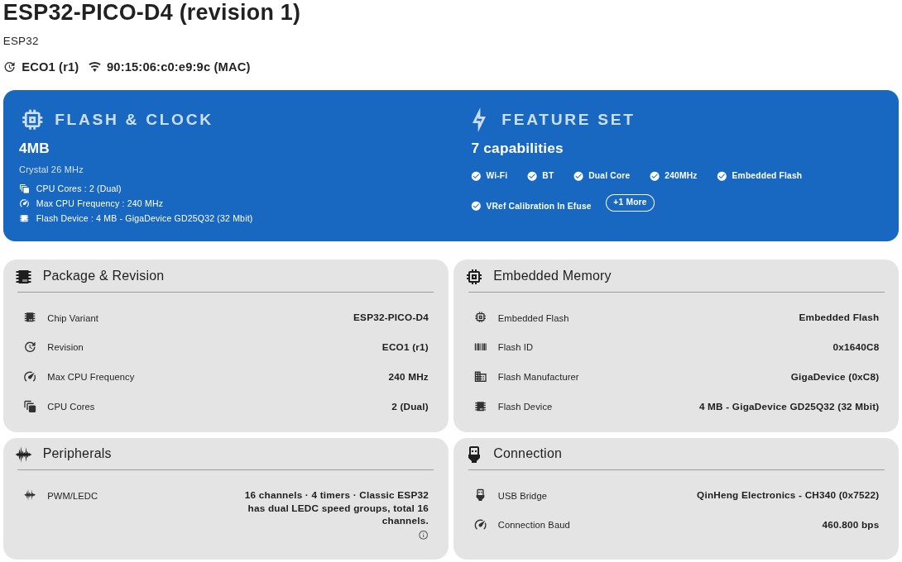
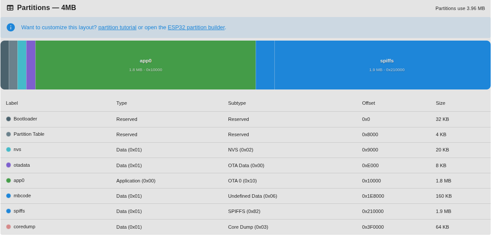
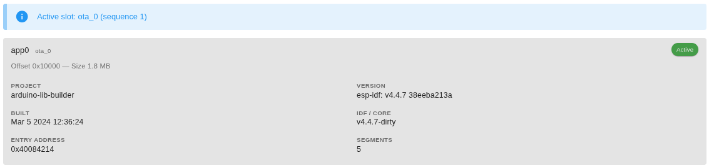
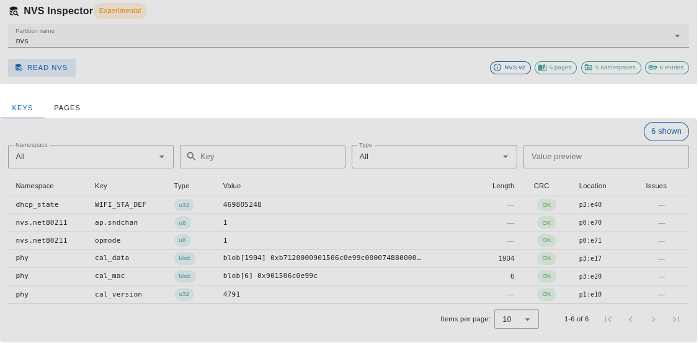

A continuación se muestra la información obtenida con la herramienta **ESPConnect** que es un centro de control basado en navegador para placas basadas en ESP32 y ESP8266. Se ejecuta completamente dentro de un navegador Chromium moderno, y permite inspeccionar detalles de hardware, administrar archivos SPIFFS, Fat y LittleFS, realizar copias de seguridad de la memoria flash e implementar firmware sin instalar software de escritorio. Se basa en [WebSerial ESPTool](https://github.com/Jason2866/WebSerial_ESPTool/tree/development) de Jason2866.

* [Acceso a la **HERRAMIENTA**](https://thelastoutpostworkshop.github.io/ESPConnect/)
* [Repositorio del **CÓDIGO**](https://github.com/thelastoutpostworkshop/ESPConnect/)

## <FONT COLOR=#007575>**Que se necesita**</font>

* Chrome, Edge, Brave, Arc u otro navegador basado en Chromium versión 89 o posterior.
* Una placa ESP32, ESP32-C3, ESP32-S2, ESP32-S3, ESP32-C6, ESP32-H2, ESP32-C5, ESP32-P4 o ESP8266 conectada a través de USB.
* Un cable USB con líneas de datos.

## <FONT COLOR=#007575>**Inicio**</font>
1. Abre [ESPConnect](https://thelastoutpostworkshop.github.io/ESPConnect/).
2. Haz clic en Conectar y elige dispositivo cuando el navegador solicite permiso.
3. Una vez completado el protocolo de enlace, el cajón de navegación desbloquea todas las herramientas: Información del dispositivo, Particiones, SPIFFS, Aplicaciones, Flash, Consola y Registros.
4. Utiliza Desconectar siempre que desees liberar el puerto USB para otra aplicación.

### <FONT COLOR=#AA0000>Información del dispositivo</font>

<center>

  

</center>

### <FONT COLOR=#AA0000>Tabla de particiones</font>
Mapa gráfico más una tabla detallada de cada entrada de partición, incluidos tamaños, desplazamientos y flash no utilizado.

<center>

  

</center>

### <FONT COLOR=#AA0000>Aplicaciones</font>
En ESP32 "OTA Slot Insights" se refiere al análisis, comprensión y gestión de cómo se utilizan las particiones de memoria flash ("slots" o ranuras). En esta pestaña se consulta qué ranura está activa, junto con los metadatos de compilación, los tamaños y otros detalles de identificación para saber siempre qué firmware se está ejecutando.

<center>

  

</center>

### <FONT COLOR=#AA0000>NVS</font>
NVS (Non-Volatile Storage) es un sistema de almacenamiento no volátil basado en la memoria flash, diseñado para guardar pares clave-valor (como configuraciones WiFi, estados de sensores) que persisten incluso tras apagar o reiniciar el dispositivo. Utiliza una partición específica, siendo más eficiente que la EEPROM y ideal para pequeñas cantidades de datos.

<center>

  

</center>

### <FONT COLOR=#AA0000>Herramientas SPIFFS, LittleFS y FATFS</font>
SPIFFS, LittleFS y FATFS son sistemas de archivos utilizados en el ESP32 para gestionar almacenamiento no volátil en la memoria flash interna o externa.

* **SPIFFS  (Serial Peripheral Interface Flash File System):** Consume poca RAM, no soporta directorios y es obsoleto. Se usa en proyectos antiguos o muy simples.
* **LittleFS (Little File System):** Robusto y a prueba de fallos de energia, soporta directorios aunque utiliza mas RAM que SPIFFS. Es la opción recomendada para la mayoría de proyectos actuales en ESP32.
* **FATFS (File Allocation Table File System):** Estándar compatible con FAT32 que consume mas recursos que los anteriores. Se usa cuando se requiere compatibilidad con lectores de tarjetas SD.

### <FONT COLOR=#AA0000>Herramientas Flash</font>
* **Flash Backup & Erase:** Captura particiones individuales, toda la tabla de particiones, solo las áreas utilizadas de la memoria flash o regiones arbitrarias que especifiques.
* **Flash Firmware:** Carga cualquier archivo ```.bin```, elige entre los ajustes preestablecidos de desplazamiento comunes, borra opcionalmente todo el chip y observa el progreso a través de diálogos detallados.
* **Register access:** Leer o escribir registros de hardware directamente utilizando la guía integrada de direcciones y descripciones.
* **Flash Integrity:** Comprobaciones de integridad proporcionando un desplazamiento y una longitud para calcular los hash MD5 y validar rápidamente lo que se almacena en el dispositivo.

### <FONT COLOR=#AA0000>Monitorización en vivo e historial</font>

* **Serial Monitor:** La pestaña Serial Monitor (Monitor serie) transmite la salida UART, envía comandos (incluido Ctrl+C), borra la consola, cambia la velocidad en baudios o reinicia la placa directamente desde el navegador.
* **Session Log:** La pestaña Session Log (Registro de sesión) es un registro cronológico de conexiones, flasheos, descargas y advertencias. Bórralo cuando quieras empezar de cero.
